## NLP and LLMs (CS40008.01) Lecture 01 – Introduction to NLP

Baojian Zhou

NLP and LLMs (CS40008.01)

School of Data Science, Fudan University

03/05/2026

---

## About me

Email:  bjzhou@fudan.edu.cn

Website :  https://baojian.github.io/  

Location :

South-401,   Computing Center 

Office hour: Wed.   10:00am-11:30am

Research interests : 

Machine learning on graphs,   optimization,   text mining   (e.g.,   using   word   embeddings),   diffusion models, and   in-context-learning   on   LLMs

2

## Outline

Course   introduction

Basics for Python,   nltk,   spacy

Tokenization

Minimum   edit distance

3

## What is  natural language ?

A structured system of communication used by humans

今天天气真好！

The weather is so nice today!

今日は天気がいい です！

Le temps est vraiment beau aujourd’hui !

\#include   \<stdio.h\>  

int   main ( void ) { 

	 printf ( “H ello,  w orld ! \n ” ); 

}  

- Formal Language (e.g., programming languages)

4

## Natural Language Processing (NLP)

NLP   is focused on enabling computers to understand, interpret, and generate human language in a way that is both meaningful and useful.  

Teach computers how to understand and generate human languages

Natural   Language   Understanding

Natural   Language   Generation

Other names

Computational Linguistics

Natural Language Engineering

Human Language Technology

AI

ML

NLP

DL

5

## Today’s NLP

6

- ChatGPT
- https://www.deepseek.com/  
- https://www.kimi.com/
- https://chat.qwen.ai/
- https://gemini.google.com/app
- https://www.together.ai/  

## NLP   history   (1947-1969)

Warren Weaver   wrote   to Wiener   in   1947

One naturally wonders if the problem of translation could conceivably be treated as a problem in cryptography. When I look at an article in Russian, I say:   ‘This is really written in English, but it  has been coded  in some strange symbols. I will now proceed to  decode ’ .

7

Warren Weaver

1894-1978

Alan Turing,   1912-1954

Alan Turing   wrote   “Computing Machinery and Intelligence”   in   1950   (proposed   the   Turing   test)

I propose to consider the question, “Can machines think?” This should begin with definitions of the meaning of the terms “machine” and “think.” 

## NLP history   (1947-1969)

Example   of   Q&A :

- C :   Please write me a sonnet on the subject of the Forth Bridge. 
- A/B :   Count me out on this one. I never could write poetry.  
- C:   Add 34 , 957 to 70 , 764. 
- A/B:   (Pause about 30 seconds and then give as answer) 105621.  
- C:   Do you play chess?   
- A/B:   Yes.  

8

Hard   part :   The   machine   A   needs   to   understand   the   person   C   and   generate   human-like   languages.

- Does GPT-4 pass the Turing test?
- Large Language Models Pass the Turing Test

the Turing test

## NLP   history   (1970-2017)

9

![PDF\] The first public demonstration of machine translation : the Georgetown- IBM system , 7 th January 1954 \| Semantic Scholar](media/ppt/media/image11.png "Picture 2")

Vladimir Vapnik ,   SVM,   1995

Attention Is All You Need ,   2017

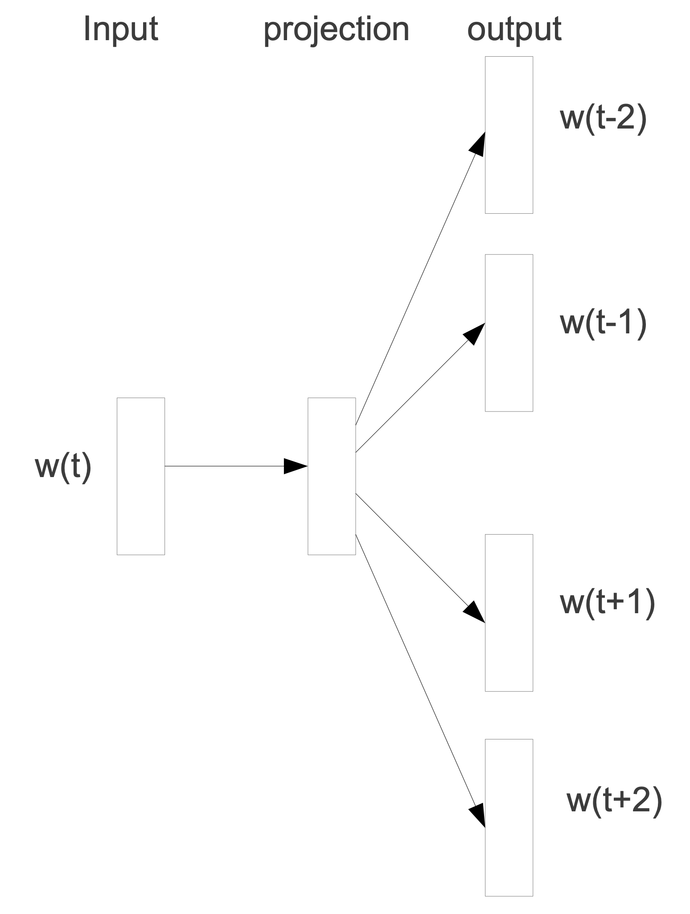

Tomas  Mikolov ,   word2vec,   2013

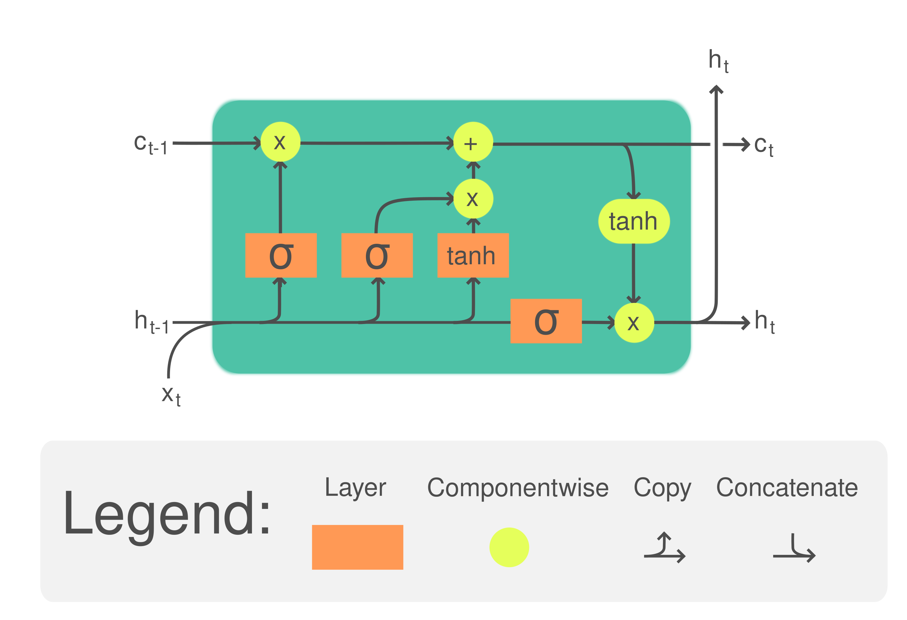

Sepp Hochreiter,   LTSM,   1996

## NLP   history   (2018-Now)   -   LLMs

10

-   By   J ustin Milner ,   https://time.graphics/line/815425
- https://ai.v-gar.de/ml/transformer/timeline/   

<!-- -->

- Bert,   ELMo
- GPT-1,2,3
- ChatGPT,   GPT-4:   https://chat.openai.com/  
- Sora:   https://openai.com/sora  

## NLP   history   (2018-Now)   -   LLMs

11

A Survey of Large Language Models

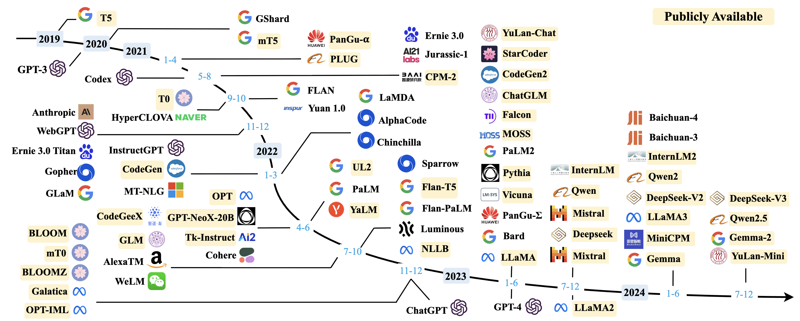

## What   is   next?

12

Sparks   of   Artificial   General   Intelligence   (AGI)

Prompt:  “ Draw a unicorn in TikZ ”   (Query GPT-4 at roughly equal time intervals while the system was being refined)

## Text data   –   written   text

Topics 

People

Events

Products

Sources 

Blogs 

Microblogs 

Forums 

Reviews

Books

13

Task: find out the pre-training datasets of the following models

-   DeepSeek-V3 ,  Qwen3 ,  Llama 3 ,  Gemini 2.5  

## Tasks - sentiment analysis

- Attributes

<!-- -->

- Z oom
- A ffordability
- S ize and weight
- F lash
- E ase of use

<!-- -->

- N ice and compact to carry! 
- S ince the camera is small and light, I won't need to carry around those heavy, bulky professional cameras either! 
- T he camera feels flimsy, is plastic and very light in weight you have to be very delicate in the handling of this camera .

✓

✗

✓

- Positive

14

- Positive

<!-- -->

- Negative

## Tasks - machine translation

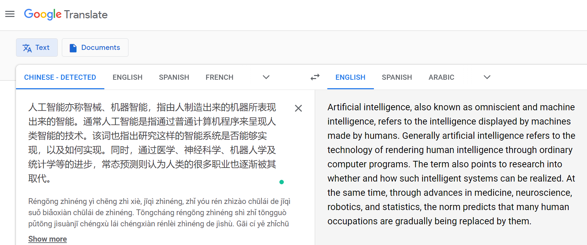

15

- Chinese      English

## Tasks - question and   answering

16

- Provide answers to question directly
- Advance version of information retrieval

## Tasks – article generation

A:  Blog

- Title : Feeling unproductive? Maybe you should stop overthinking. 
- Content : In order to get something done, maybe we need to think less. Seems counter-intuitive, but I believe sometimes our thoughts can get in the way of the creative process. We can work better at times when we "tune out" the external world and focus on what's in front of us. I've been thinking about this lately, so I thought it would be good to write an article about it…

B: News article

- Title : United Methodists Agree to Historic Split
- Content : After two days of intense debate, the United Methodist Church has agreed to a historic split - one that is expected to end in the creation of a new denomination, one that will be “theologically and socially conservative,” according to The Washington Post. The majority of delegates attending the church‘s annual General Conference in May voted to strengthen a ban on the ordination of LGBTQ clergy and to write new rules that will “discipline” clergy who officiate at same-sex weddings. But those who opposed these measures have a new plan…

 A: Human Written	B: Human  Written

 A: Machine Written 	B: Human  Written

 A: Human Written 	B: Machine  Written

 A: Machine Written 	B: Machine  Written

They are all generated by GPT-3!

17

## Tasks – text summarization

18

News Rewriting

从 1981 年到 2010 年，全国平均降水量为 280 毫米  …

Summarization   from   images

## Tasks – build   Chatbot

19

A : Men are all alike

B : In what way?

A : They're always bugging us about something or other.

B : Can you think of a specific example?

A : Well, my boyfriend made me come here. 

B : Your boyfriend made you come here?

A : He says I'm depressed much of the time. 

B : I’m sorry to hear you are depressed.

A : It’s true. I am unhappy.

B : Do you think coming here will help you not to be unhappy?

A : I need some help, that much seems certain.…

 A: Human	B: Human

 A: Machine 	B: Human

 A: Human 	B: Machine

 A: Machine 	B: Machine

A: Human B: Machine

## Tasks – text   to   image

Creating image from text   IO (OpenAI,   Sora)

20

A snowy mountain village with cozy cabins and a northern lights display, high detail and photorealistic  dslr , 50mm f/1.2

Vibrant coral reef teeming with colorful fish and sea creatures

Close-up portrait shot of a woman in autumn, extreme detail, shallow depth of field

## Tasks – text   to   video

Creating video from text:   a   woman   wearing   purple   overalls   and   cowboy   boots   taking   a   pleasant   stroll   in   Johannesburg   South   Africa   during   a   beautiful   sunset

21

OpenAI,   Sora

## Tasks – text   to   video

22

Creating video from text :  an   old   man   wearing   blue   jeans   and   a   white   T -shirt   taking   a   pleasant   stroll   in   Antarctica   during   a   winter   storm

OpenAI,   Sora

## Many other   NLP tasks/products

23

Exploring the Landscape of Natural Language Processing Research

Predicted   before   LLMs   era

If I were starting a company today, it would use AI to teach computers how to read.

## NLP is difficult!

Ambiguity makes NLP hard !

A man saw a boy  with a telescope .   —   Who had the telescope?

He has  quit   smoking .   —   It   means   that   h e smoked before.

What does the  Mighty Dragon   mean ？

24

## Ambiguities in English/Chinese

Teacher  strikes  idle kids.

The chickens are too  hot  to eat.  

The  old  men and women left the room.

He left her  in tears .

Hospitals are sued by  6 foot doctors .

25

冬天，能穿多少穿多少；夏天，能穿多少穿多少；

单身的来由：原来是喜欢一个人，现在是喜欢一个人；

女致电男友：地铁站见。如果你到了我还没到，你就等着吧。如果我到了你还没到，你就等着吧！

## Hard to inference

Example

A dime is better than a nickel

A nickel is better than a penny

Therefore, a dime is better than a penny

Adversarial Example

A penny is better than nothing

Nothing is better than world peace.

Therefore, a penny is better than world peace ???

26

## Other difficulties

Non-standard English

Great job @justinbieber! Were SOO PROUD of what youve accomplished! U taught us 2 #neversaynever & you yourself should never give up either♥

Segmentation issues

Idioms

dark horse

lose face

break a leg

b ite the bullet

Neologisms

unfriend

Retweet

bromance

鸡娃

Tricky entity names

Where is  A Bug’s Life  playing …

Let It Be  was recorded …

World knowledge

Mary and Sue are sisters.

Mary and Sue are mothers.

the New York-New Haven Railroad

the New York-New Haven Railroad

27

San Francisco

Los Angeles

## NLP conferences   and   people

Natural Language Processing

ACL, EMNLP, COLING, NAACL, EACL ( https://aclanthology.org/  )

Machine learning

ICML, NIPS, ICLR

Information Retrieval

SIGIR, WWW, CIKM, WSDM

Data Mining

KDD

28

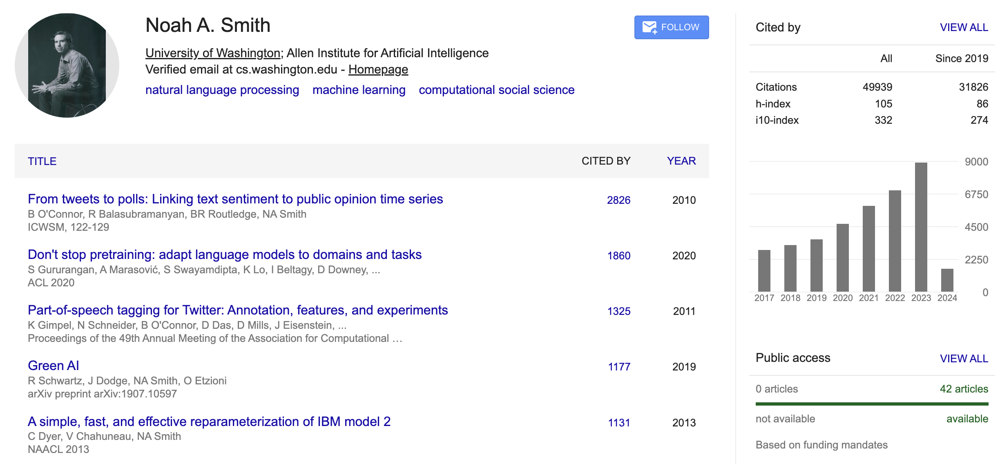

People in NLP

## People in NLP (China)

https://www.zhihu.com/question/24366306

29

邱锡鹏老师的回答：

https://www.zhihu.com/question/24366306/answer/123787923

## What we will cover?   (tentative)

30

(LLMs)   Pretraining   and   fine-tuning

(LLMs)   Evaluation   and   benchmarking

(LLMs)   In-context-learning

(LLMs)   Reasoning and   Agents

(LLMs)  Diffusion Language Models

(Applications)   Machine   translation

(Applications)   Syntactic   analysis

## Skills needed

Linear algebra    ( vectors, matrices)

Basic Statistics   /   Machine Learning algorithms

Basic   Python programming skills   ( numpy ,   pytorch )

Communication skills   (team   project)

31

## Coursework

Participation (5%)

Quizzes   (10%)

Assignments (45-50%)

Final Project (35-40%)

Office hours

Lecturer:  Baojian Zhou, Wed.   10:00-11:30am

TA:  Binbin   Huang （黄彬彬 ,  24210980091@m.fudan.edu.cn ) ， 

           Yuxiang   Wang   ( 王煜祥 ,   25210980109@m.fudan.edu.cn )

Submit to Fudan eLearning:  https://elearning.fudan.edu.cn/  

Integrity policy:  http://xxgk.fudan.edu.cn/bd/61/c5163a48481/page.htm

32

## Textbooks

Dan Jurafsky and James H. Martin, Speech and Language Processing,  https://web.stanford.edu/~jurafsky/slp3/

Jacob Eisenstein,   Natural Language Processing,   2018

张奇、桂韬、黄萱菁，自然语言处理导论 ,  https://intro-nlp.github.io/ , 2022 

33

## Other useful   resources

Stanford CS 224N:  Deep learning for NLP ,   Chr istopher Manning

CMU   11-711   ANLP:   Advanced NLP ,   Graham Neubig

UMass CS685 :  Advanced NLP ,   Mohit Iyyer

COS   484:   https://princeton-nlp.github.io/cos484/   ,   Danqi   Chen

Online   courses:   Neural Networks: Zero to Hero ,   Andrej   Karpathy

Stanford CS 124:  From Languages to Information , Dan Jurafsky

34

## GPU   resources

35

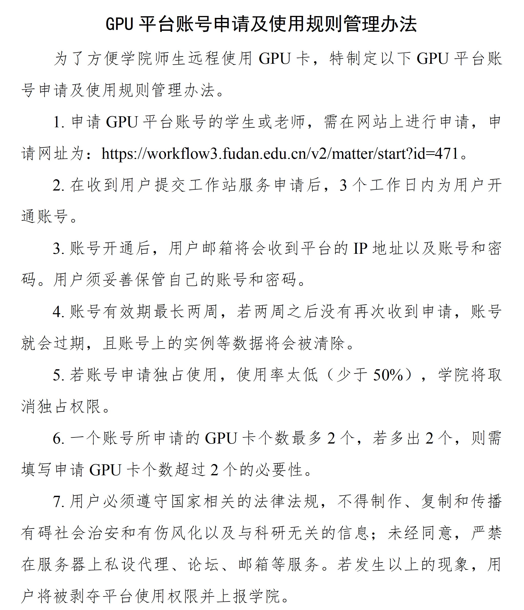

NLP课程PJ ： xxx

xxx

xxx

## Outline

Course   introduction

Basics for Python,   nltk,   spacy

Tokenization

Minimum   edit distance

36

## Install Python & Tools

Python

https://www.python.org/downloads/   Python3.10

Python IDE

PyCharm  -  https://www.jetbrains.com/pycharm/

Jupyter   notebook  -  https://jupyter.org/

VS   Code   -   https://code.visualstudio.com/  

Anaconda

https://www.anaconda.com/  (Strongly Recommended)

Git

https://github.com/   to manage your code

37

## PyCharm is free for students

38

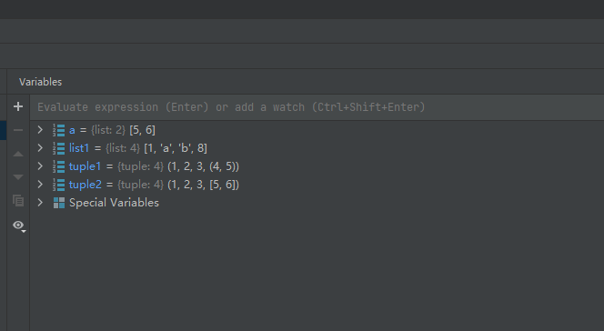

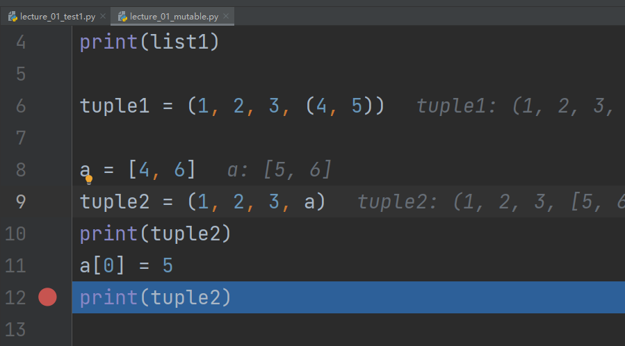

Use your  fudan.edu.cn  email account			

Debug on PyCharm

Cursor:  https://cursor.com/home  

## AI tools  Cursor

39

## Install anaconda   and   Python   env

Download:  https://docs.anaconda.com/anaconda/install/index.html

Activate:   source ~ /anaconda3/bin activate

Create env:  conda create -n llm-26 python=3.12

Activate env:  conda activate llm-26

Type python, you will go into python env under  llm-26

40

Install:  conda  install -c  conda -forge  jupyterlab

Open your notebook: 

Download some text data:  https://www.nltk.org/data.html  

Jupyter notebook

## Packages need to install

Packages （ This lecture: nltk,   spacy, Jupyter, matplotlib, transformers ）

Package Install:   conda   install   xxx,   pip install (not   to   mix   them)

Use Package ： import nltk  

41

NLTK

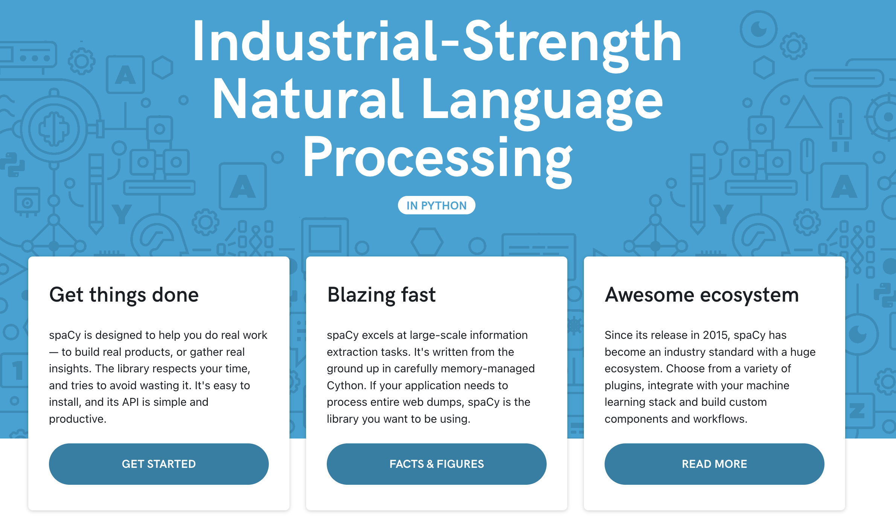

spaCy

## Text searching

In what kind of contexts is the word  monstrous  typically used?

42

Try   our   demo   code   lecture-01-exercise.ipynb

## Text searching

What are some words with similar usage to ‘good’?

What are the contexts in which the words ‘good’ and ‘great’ can be used interchangeably?

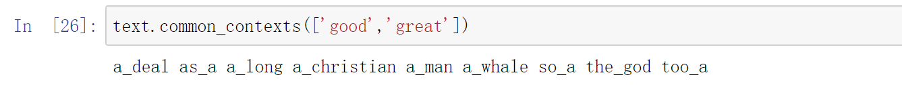

43

## Text searching

Plotting the distribution of specific words in the text: the  text2  corpus, from the novel  Sense and Sensibility . Elinor, Marianne, Edward, and John are four key characters in the novel—how do they appear throughout the novel?

- Elinor Dashwood
- Marianne Dashwood
- Edward  Ferrars
- John Willoughby

44

## Text searching

Edward

Willoughby

Marianne Elinor

45

## Regular expressions

A formal language for specifying text strings

How can we search for any of these?

woodchuck ( 土拨鼠 )

woodchucks

Woodchuck

Woodchucks

Need a tool to help us

46

lecture-01-exercise.ipynb

## RE: disjunctions

Letters inside square brackets \[\]

Ranges \[A-Z\]

| Pattern        | Matches               |
|----------------|-----------------------|
| \[wW\]oodchuck | Woodchuck,  woodchuck |
| \[1234567890\] | Any digit             |

| Pattern | Matches              | Example String                    |
|---------|----------------------|-----------------------------------|
| \[A-Z\] | An upper case letter | D renched Blossoms                |
| \[a-z\] | A lower case letter  | m y beans were impatient          |
| \[0-9\] | A single  digit      | Chapter  1 : Down the Rabbit Hole |

47

## RE: negation in disjunction

Negations: e.g., \[^Ss\]

Caret  ( 脱字符 ): negation only when first in \[\]

| Pattern  | Matches                    | Example String               |
|----------|----------------------------|------------------------------|
| \[^A-Z\] | Not  an  upper case letter | O y fn   pripetchik          |
| \[^Ss\]  | Neither ‘S’ nor ‘s’        | I  have no exquisite reason” |
| \[^e^\]  | Neither e nor ^            | L ook h e re                 |
| a\\b     | The pattern   a ^ b        | Look up  a^b   now           |

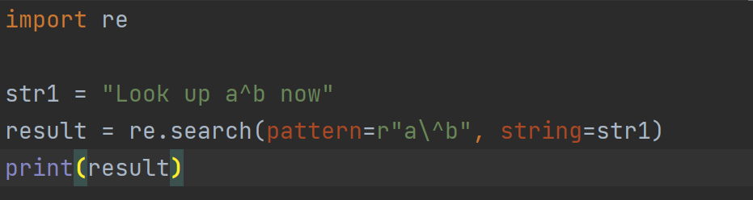

48

## RE: more disjunction

Woodchucks is another name for groundhog!

The pipe \| for disjunction

| Pattern                               | Matches                 |
|---------------------------------------|-------------------------|
| groundhog \| woodchuck                | groundhog and woodchuck |
| yours \| mine                         | yours  mine             |
| a \| b \| c                           | =  \[abc\]              |
| \[ gG \] roundhog \| \[ Ww \]oodchuck | ???                     |

49

## RE: ? \* + .

| Pattern | Matches                      | Matched examples               |
|---------|------------------------------|--------------------------------|
| colou?r | Optional  previous char      | color      colour              |
| oo \*h! | 0 or more of   previous char | oh!   ooh!    oooh !   ooooh ! |
| o+h !   | 1 or more of previous char   | oh!   ooh!    oooh !   ooooh ! |
| baa+    | 1 or more of previous char   | baa   baaa   baaaa   baaaaa    |
| beg.n   | any char                     | begin  begun begun beg3n       |

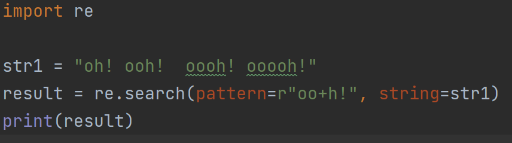

50

## RE: find all “the” in a text

-  Find me all instances of the word “the” in a text.

the

                                                Misses capitalized examples

\[ tT \]he

                                                Incorrectly returns  other  or  theology

\[^a- zA -Z\] \[ tT \] he \[^a- zA -Z\]

-  More on Regular Expression:  Chapter 3 on Natural Language Processing with Python  http://www.nltk.org/book/ch03.html                                             

<!-- -->

- 

51

## Outline

Course   introduction

Basics for Python,   nltk ,   spacy

Tokenization

Minimum   edit distance

52

## Tokenization

T okenization is the process of breaking down text into pieces, called tokens, such as words, subwords, or characters, which serve as the input for the model, enabling it to learn effective models.

Input text: 		 What   is   token ization ? 

Output token IDs: 	    4827    382   6602  2860  30

53

https://huggingface.co/docs/transformers/tokenizer_summary  

There are three types:

Word tokenization

Subword tokenization

Character tokenization

https://platform.openai.com/tokenizer  (GPT-4o)

## Subword tokenization

Idea : Instead of white-space or single-character segmentation. One can use the raw text data to tell us how to tokenize words. Because tokens can be parts of words as well as whole words.

Three common algorithms

Byte-Pair Encoding (BPE)  ( Sennrich et al., 2016 )

Unigram  ( Kudo, 2018 )

WordPiece  ( Schuster and Nakajima, 2012 )

All subword tokenization algorithms have 2 parts

A  token learner  that takes a raw training corpus and induces a vocabulary (a set of tokens). Most subword algorithms are run inside space-separated tokens. So we commonly first add a special end-of-word symbol “\_” before space in training corpus.

A  token segmenter  that takes a raw test sentence and tokenizes it according to that vocabulary

54

## Subword tokenization - BPE

55

## Subword tokenization - BPE

Training corpus:  low low low low low lowest lowest newer newer newer newer newer newer wider wider wider new new

Step 0 : Add a special end-of-word symbol “\_” (word boundaries) before space in training corpus and then tokenize text by whitespace. We then separate into letters.

Step 1 : Create the vocabulary: {\_, d, e, i, l, n, o, r, s, t, w} .

Step 2 :  R epeat the merging steps,  two symbols that are most frequently adjacent in the training corpus .

56

## Subword tokenization - BPE

Training corpus:  low low low low low lowest lowest newer newer newer   newer newer newer wider wider wider new new

Add end-of-word tokens, resulting in this vocabulary:

57

Vocabulary

\_,   d,   e,   i,   l,   n,   o,   r,   s,   t,   w

Corpus   representation

5   l   o   w   \_

2   l   o   w   e   s   t   \_

6   n   e   w   e   r   \_

3   w   i   d   e   r   \_

2   n   e   w   \_

## Subword tokenization - BPE

BPE token learner

58

Vocabulary

\_,   d,   e,   i,   l,   n,   o,   r,   s,   t,   w

Corpus   representation

5   l   o   w   \_

2   l   o   w   e   s   t   \_

6   n   e   w   e   r   \_

3   w   i   d   e   r   \_

2   n   e   w   \_

Merge  e r  to  er

Vocabulary

\_,   d,   e,   i,   l,   n,   o,   r,   s,   t,   w,   er

Corpus   representation

5   l   o   w   \_

2   l   o   w   e   s   t   \_

6   n   e   w   er   \_

3   w   i   d   er   \_

2   n   e   w   \_

## Subword tokenization - BPE

BPE token learner

59

Vocabulary

\_,   d,   e,   i,   l,   n,   o,   r,   s,   t,   w,   er

Corpus   representation

5   l   o   w   \_

2   l   o   w   e   s   t   \_

6   n   e   w   er   \_

3   w   i   d   er   \_

2   n   e   w   \_

Merge  er   \_  to  er \_

Vocabulary

\_,   d,   e,   i,   l,   n,   o,   r,   s,   t,   w,   er,   er\_

Corpus   representation

5   l   o   w   \_

2   l   o   w   e   s   t   \_

6   n   e   w   er\_

3   w   i   d   er\_

2   n   e   w   \_

## Subword tokenization - BPE

BPE token learner

60

Vocabulary

\_,   d,   e,   i,   l,   n,   o,   r,   s,   t,   w,   er,   er\_

Corpus   representation

5   l   o   w   \_

2   l   o   w   e   s   t   \_

6   n   e   w   er\_

3   w   i   d   er\_

2   n   e   w   \_

Merge  n   e  to  ne

Vocabulary

\_,   d,   e,   i,   l,   n,   o,   r,   s,   t,   w,   er,   er\_,   ne

Corpus   representation

5   l   o   w   \_

2   l   o   w   e   s   t   \_

6   ne   w   er\_

3   w   i   d   er\_

2   ne   w   \_

## Subword tokenization - BPE

BPE token learner

The next merges are:

Merge				Current   Vocabulary

(ne,   w)	 \_,   d,   e,   i ,   l,   n,   o,   r,   s,   t,   w,   er,   er\_,   ne,   new

(l,   o)		 \_,   d,   e,   i ,   l,   n,   o,   r,   s,   t,   w,   er,   er\_,   ne,   new,   lo

(lo,   w)	 \_,   d,   e,   i ,   l,   n,   o,   r,   s,   t,   w,   er,   er\_,   ne,   new,   low

(new,   er\_)	 \_,   d,   e,   i ,   l,   n,   o,   r,   s,   t,   w,   er,   er\_,   ne,   new,   low,   newer\_

(low,   er\_)	 \_,   d,   e,   i ,   l,   n,   o,   r,   s,   t,   w,   er,   er\_,   ne,   new,   low,   newer\_,   low\_

61

## Subword tokenization - BPE

T oken   segmenter :   On the test data, run each merge learned from the training data:

Greedily   and   i n the order we learned them

T est frequencies don't play a role

So ,   merge every  e r  to  er , then merge  er \_  to  er\_ , etc.

Testing   examples

Test set "n e w e r \_" would be tokenized as a full word 

Test set "l o w e r \_" would be two tokens: "low er\_"

62

- One nice property of BPE is that tokens usually include frequent words   a nd frequent subwords which are often morphemes like -est or -er. 
- For example, unlikeliest has 3 morphemes un-, likely, and -est.

Zouhar ,  Vilém , Clara Meister, Juan Gastaldi, Li Du, Tim Vieira,  Mrinmaya   Sachan , and Ryan  Cotterell . "A Formal Perspective on Byte-Pair Encoding." In Findings of the Association for Computational Linguistics: ACL 2023, pp. 598-614. 2023.

## Try   BPE  by yourself

https://platform.openai.com/tokenizer  

Text = “Chapters 5 to 8 teach the basics of 🤗 Datasets and 🤗 Tokenizers before diving into classic NLP tasks. By the end of this part, you will be able to tackle the most common NLP problems by yourself. By the end of this part, you will be ready to apply 🤗 Transformers to (almost) any machine learning problem! E=mc^2. f(x) = x^2+y^2, print('hello world!’) baojianzhou. asdasfasdgasdg”

Tokenizers  has been split into  Token   izers

baojianzhou  has been split into  bao   jian   zhou

Another   great   tool:   https://tiktokenizer.vercel.app/  

https://github.com/openai/tiktoken  

63

## Outline

Course   introduction

Basics for Python,   nltk ,   spacy

Tokenization

Minimum   edit distance

64

## How similar are two strings?

Spell correction

The user typed “graffe”. Given candidate set  { graf   graft  grail  giraffe } 

Which is closest?   

Computational Biology

Align two sequences of nucleotides

		AGGCTATCACCTGACCTCCAGGCCGATGCCC

		TAGCTATCACGACCGCGGTCGATTTGCCCGAC

Resulting alignment

		 - AG G CTATCAC CT GACC T C CA GG C CGA -- TGCCC ---

		T AG - CTATCAC -- GACC G C -- GG T CGA TT TGCCC GAC

65

## How similar are two strings?

Machine Translation (Task: Chinese -\> English)

Chinese:   	 这个机场的安全工作由以色列方面负责

Reference: 	Israeli officials are responsible for airport security

Model 1: 	Israeli officials responsibility of airport safety

Model 2: 	Israel is responsible for safety work at this airport

Model 3: 	Israel presides over the security of the airport

Model 4: 	Israel took charge of the airport security

       Which translation model is the best? 

66

## Edit Distance 

The minimum edit distance between two strings

String X  -\>  String Y

Is the minimum number of editing operations

Insertion (i)

Deletion (d)

Substitution (s)

T ransform  String X  into  String Y

67

## Minimum Edit Distance   (MED)

- Two strings and their  alignment
- String X  = INTENTION
- String Y  = EXECUTION
- 

I

N

T

E

\*

N

T

I

O

N

\*

E

X

E

C

U

T

I

O

N

Deletion

Substitution

Insertion

If each operation has cost of 1

Distance between X and Y is 5

If substitutions cost 2

Distance between X and Y is 8

68

## How to find   MED?

- Searching for a path (sequence of edits) from the start string to the final string:

<!-- -->

- Initial state : the word we   a re transforming
- Operators : insert, delete, substitute
- Goal state :  the word we   a re trying to get to
- Path cost : the number of   weighted  edits

<!-- -->

- 

INTENTION

NTENTION

E INTENTION

E NTENTION

Del

Ins

Sub

Number of edit sequences is huge

Do   n o t have to track of all of them

Just the shortest path to each of those revis i ted states.

69

## Defining MED

70

## Dynamic   programming   for   MED

71

## MED table: initialization

| N   | 9   |     |     |     |     |     |     |     |     |     |
|-----|-----|-----|-----|-----|-----|-----|-----|-----|-----|-----|
| O   | 8   |     |     |     |     |     |     |     |     |     |
| I   | 7   |     |     |     |     |     |     |     |     |     |
| T   | 6   |     |     |     |     |     |     |     |     |     |
| N   | 5   |     |     |     |     |     |     |     |     |     |
| E   | 4   |     |     |     |     |     |     |     |     |     |
| T   | 3   |     |     |     |     |     |     |     |     |     |
| N   | 2   |     |     |     |     |     |     |     |     |     |
| I   | 1   |     |     |     |     |     |     |     |     |     |
| \#  | 0   | 1   | 2   | 3   | 4   | 5   | 6   | 7   | 8   | 9   |
|     | \#  | E   | X   | E   | C   | U   | T   | I   | O   | N   |

72

## MED table: second column

| N   | 9   |     |     |     |     |     |     |     |     |     |
|-----|-----|-----|-----|-----|-----|-----|-----|-----|-----|-----|
| O   | 8   |     |     |     |     |     |     |     |     |     |
| I   | 7   |     |     |     |     |     |     |     |     |     |
| T   | 6   |     |     |     |     |     |     |     |     |     |
| N   | 5   |     |     |     |     |     |     |     |     |     |
| E   | 4   |     |     |     |     |     |     |     |     |     |
| T   | 3   |     |     |     |     |     |     |     |     |     |
| N   | 2   |     |     |     |     |     |     |     |     |     |
| I   | 1   |     |     |     |     |     |     |     |     |     |
| \#  | 0   | 1   | 2   | 3   | 4   | 5   | 6   | 7   | 8   | 9   |
|     | \#  | E   | X   | E   | C   | U   | T   | I   | O   | N   |

?

73

## MED table: second column

| N   | 9   |     |     |     |     |     |     |     |     |     |
|-----|-----|-----|-----|-----|-----|-----|-----|-----|-----|-----|
| O   | 8   |     |     |     |     |     |     |     |     |     |
| I   | 7   |     |     |     |     |     |     |     |     |     |
| T   | 6   |     |     |     |     |     |     |     |     |     |
| N   | 5   |     |     |     |     |     |     |     |     |     |
| E   | 4   |     |     |     |     |     |     |     |     |     |
| T   | 3   |     |     |     |     |     |     |     |     |     |
| N   | 2   |     |     |     |     |     |     |     |     |     |
| I   | 1   | 2   |     |     |     |     |     |     |     |     |
| \#  | 0   | 1   | 2   | 3   | 4   | 5   | 6   | 7   | 8   | 9   |
|     | \#  | E   | X   | E   | C   | U   | T   | I   | O   | N   |

Substitution

74

## MED table: second column

| N   | 9   |     |     |     |     |     |     |     |     |     |
|-----|-----|-----|-----|-----|-----|-----|-----|-----|-----|-----|
| O   | 8   |     |     |     |     |     |     |     |     |     |
| I   | 7   |     |     |     |     |     |     |     |     |     |
| T   | 6   |     |     |     |     |     |     |     |     |     |
| N   | 5   |     |     |     |     |     |     |     |     |     |
| E   | 4   | ?   |     |     |     |     |     |     |     |     |
| T   | 3   | 4   |     |     |     |     |     |     |     |     |
| N   | 2   | 3   |     |     |     |     |     |     |     |     |
| I   | 1   | 2   |     |     |     |     |     |     |     |     |
| \#  | 0   | 1   | 2   | 3   | 4   | 5   | 6   | 7   | 8   | 9   |
|     | \#  | E   | X   | E   | C   | U   | T   | I   | O   | N   |

75

## MED table: second column

| N   | 9   |     |     |     |     |     |     |     |     |     |
|-----|-----|-----|-----|-----|-----|-----|-----|-----|-----|-----|
| O   | 8   |     |     |     |     |     |     |     |     |     |
| I   | 7   |     |     |     |     |     |     |     |     |     |
| T   | 6   |     |     |     |     |     |     |     |     |     |
| N   | 5   |     |     |     |     |     |     |     |     |     |
| E   | 4   | 3   |     |     |     |     |     |     |     |     |
| T   | 3   | 4   |     |     |     |     |     |     |     |     |
| N   | 2   | 3   |     |     |     |     |     |     |     |     |
| I   | 1   | 2   |     |     |     |     |     |     |     |     |
| \#  | 0   | 1   | 2   | 3   | 4   | 5   | 6   | 7   | 8   | 9   |
|     | \#  | E   | X   | E   | C   | U   | T   | I   | O   | N   |

Unchanged

76

## Final MED table

| N   | 9   | 8   | 9   | 10  | 11  | 12  | 11  | 10  | 9   | 8   |
|-----|-----|-----|-----|-----|-----|-----|-----|-----|-----|-----|
| O   | 8   | 7   | 8   | 9   | 10  | 11  | 10  | 9   | 8   | 9   |
| I   | 7   | 6   | 7   | 8   | 9   | 10  | 9   | 8   | 9   | 10  |
| T   | 6   | 5   | 6   | 7   | 8   | 9   | 8   | 9   | 10  | 11  |
| N   | 5   | 4   | 5   | 6   | 7   | 8   | 9   | 10  | 11  | 10  |
| E   | 4   | 3   | 4   | 5   | 6   | 7   | 8   | 9   | 10  | 9   |
| T   | 3   | 4   | 5   | 6   | 7   | 8   | 7   | 8   | 9   | 8   |
| N   | 2   | 3   | 4   | 5   | 6   | 7   | 8   | 7   | 8   | 7   |
| I   | 1   | 2   | 3   | 4   | 5   | 6   | 7   | 6   | 7   | 8   |
| \#  | 0   | 1   | 2   | 3   | 4   | 5   | 6   | 7   | 8   | 9   |
|     | \#  | E   | X   | E   | C   | U   | T   | I   | O   | N   |

77

## Computing alignment

Edit distance is   not sufficient

Need to  align  each character of the two strings to each other

Keep   a “backtrace”

Every time we enter a cell, remember where we came from

When we reach the end, 

Trace back the path from the upper right to read off the alignment

78

## Computing   alignment

| N   | 9   | 8   | 9   | 10  | 11  | 12  | 11  | 10  | 9   | 8   |
|-----|-----|-----|-----|-----|-----|-----|-----|-----|-----|-----|
| O   | 8   | 7   | 8   | 9   | 10  | 11  | 10  | 9   | 8   | 9   |
| I   | 7   | 6   | 7   | 8   | 9   | 10  | 9   | 8   | 9   | 10  |
| T   | 6   | 5   | 6   | 7   | 8   | 9   | 8   | 9   | 10  | 11  |
| N   | 5   | 4   | 5   | 6   | 7   | 8   | 9   | 10  | 11  | 10  |
| E   | 4   | 3   | 4   | 5   | 6   | 7   | 8   | 9   | 10  | 9   |
| T   | 3   | 4   | 5   | 6   | 7   | 8   | 7   | 8   | 9   | 8   |
| N   | 2   | 3   | 4   | 5   | 6   | 7   | 8   | 7   | 8   | 7   |
| I   | 1   | 2   | 3   | 4   | 5   | 6   | 7   | 6   | 7   | 8   |
| \#  | 0   | 1   | 2   | 3   | 4   | 5   | 6   | 7   | 8   | 9   |
|     | \#  | E   | X   | E   | C   | U   | T   | I   | O   | N   |

79

## Computing   alignment

| N   | 9   | 8   | 9   | 10  | 11  | 12  | 11  | 10  | 9   | 8   |
|-----|-----|-----|-----|-----|-----|-----|-----|-----|-----|-----|
| O   | 8   | 7   | 8   | 9   | 10  | 11  | 10  | 9   | 8   | 9   |
| I   | 7   | 6   | 7   | 8   | 9   | 10  | 9   | 8   | 9   | 10  |
| T   | 6   | 5   | 6   | 7   | 8   | 9   | 8   | 9   | 10  | 11  |
| N   | 5   | 4   | 5   | 6   | 7   | 8   | 9   | 10  | 11  | 10  |
| E   | 4   | 3   | 4   | 5   | 6   | 7   | 8   | 9   | 10  | 9   |
| T   | 3   | 4   | 5   | 6   | 7   | 8   | 7   | 8   | 9   | 8   |
| N   | 2   | 3   | 4   | 5   | 6   | 7   | 8   | 7   | 8   | 7   |
| I   | 1   | 2   | 3   | 4   | 5   | 6   | 7   | 6   | 7   | 8   |
| \#  | 0   | 1   | 2   | 3   | 4   | 5   | 6   | 7   | 8   | 9   |
|     | \#  | E   | X   | E   | C   | U   | T   | I   | O   | N   |

80

## Computing   alignment

| N   | 9   | 8   | 9   | 10  | 11  | 12  | 11  | 10  | 9   | 8   |
|-----|-----|-----|-----|-----|-----|-----|-----|-----|-----|-----|
| O   | 8   | 7   | 8   | 9   | 10  | 11  | 10  | 9   | 8   | 9   |
| I   | 7   | 6   | 7   | 8   | 9   | 10  | 9   | 8   | 9   | 10  |
| T   | 6   | 5   | 6   | 7   | 8   | 9   | 8   | 9   | 10  | 11  |
| N   | 5   | 4   | 5   | 6   | 7   | 8   | 9   | 10  | 11  | 10  |
| E   | 4   | 3   | 4   | 5   | 6   | 7   | 8   | 9   | 10  | 9   |
| T   | 3   | 4   | 5   | 6   | 7   | 8   | 7   | 8   | 9   | 8   |
| N   | 2   | 3   | 4   | 5   | 6   | 7   | 8   | 7   | 8   | 7   |
| I   | 1   | 2   | 3   | 4   | 5   | 6   | 7   | 6   | 7   | 8   |
| \#  | 0   | 1   | 2   | 3   | 4   | 5   | 6   | 7   | 8   | 9   |
|     | \#  | E   | X   | E   | C   | U   | T   | I   | O   | N   |

81

## Computing   alignment

| N   | 9   | 8   | 9   | 10  | 11  | 12  | 11  | 10  | 9   | 8   |
|-----|-----|-----|-----|-----|-----|-----|-----|-----|-----|-----|
| O   | 8   | 7   | 8   | 9   | 10  | 11  | 10  | 9   | 8   | 9   |
| I   | 7   | 6   | 7   | 8   | 9   | 10  | 9   | 8   | 9   | 10  |
| T   | 6   | 5   | 6   | 7   | 8   | 9   | 8   | 9   | 10  | 11  |
| N   | 5   | 4   | 5   | 6   | 7   | 8   | 9   | 10  | 11  | 10  |
| E   | 4   | 3   | 4   | 5   | 6   | 7   | 8   | 9   | 10  | 9   |
| T   | 3   | 4   | 5   | 6   | 7   | 8   | 7   | 8   | 9   | 8   |
| N   | 2   | 3   | 4   | 5   | 6   | 7   | 8   | 7   | 8   | 7   |
| I   | 1   | 2   | 3   | 4   | 5   | 6   | 7   | 6   | 7   | 8   |
| \#  | 0   | 1   | 2   | 3   | 4   | 5   | 6   | 7   | 8   | 9   |
|     | \#  | E   | X   | E   | C   | U   | T   | I   | O   | N   |

82

## Computing   alignment

| N   | 9   | 8   | 9   | 10  | 11  | 12  | 11  | 10  | 9   | 8   |
|-----|-----|-----|-----|-----|-----|-----|-----|-----|-----|-----|
| O   | 8   | 7   | 8   | 9   | 10  | 11  | 10  | 9   | 8   | 9   |
| I   | 7   | 6   | 7   | 8   | 9   | 10  | 9   | 8   | 9   | 10  |
| T   | 6   | 5   | 6   | 7   | 8   | 9   | 8   | 9   | 10  | 11  |
| N   | 5   | 4   | 5   | 6   | 7   | 8   | 9   | 10  | 11  | 10  |
| E   | 4   | 3   | 4   | 5   | 6   | 7   | 8   | 9   | 10  | 9   |
| T   | 3   | 4   | 5   | 6   | 7   | 8   | 7   | 8   | 9   | 8   |
| N   | 2   | 3   | 4   | 5   | 6   | 7   | 8   | 7   | 8   | 7   |
| I   | 1   | 2   | 3   | 4   | 5   | 6   | 7   | 6   | 7   | 8   |
| \#  | 0   | 1   | 2   | 3   | 4   | 5   | 6   | 7   | 8   | 9   |
|     | \#  | E   | X   | E   | C   | U   | T   | I   | O   | N   |

83

## Computing   alignment

| N   | 9   | 8   | 9   | 10  | 11  | 12  | 11  | 10  | 9   | 8   |
|-----|-----|-----|-----|-----|-----|-----|-----|-----|-----|-----|
| O   | 8   | 7   | 8   | 9   | 10  | 11  | 10  | 9   | 8   | 9   |
| I   | 7   | 6   | 7   | 8   | 9   | 10  | 9   | 8   | 9   | 10  |
| T   | 6   | 5   | 6   | 7   | 8   | 9   | 8   | 9   | 10  | 11  |
| N   | 5   | 4   | 5   | 6   | 7   | 8   | 9   | 10  | 11  | 10  |
| E   | 4   | 3   | 4   | 5   | 6   | 7   | 8   | 9   | 10  | 9   |
| T   | 3   | 4   | 5   | 6   | 7   | 8   | 7   | 8   | 9   | 8   |
| N   | 2   | 3   | 4   | 5   | 6   | 7   | 8   | 7   | 8   | 7   |
| I   | 1   | 2   | 3   | 4   | 5   | 6   | 7   | 6   | 7   | 8   |
| \#  | 0   | 1   | 2   | 3   | 4   | 5   | 6   | 7   | 8   | 9   |
|     | \#  | E   | X   | E   | C   | U   | T   | I   | O   | N   |

I

N

T

E

\*

N

T

I

O

N

\*

E

X

E

C

U

T

I

O

N

84

## Computing   alignment - properties

When entering a value in each cell, we mark which of the three neighboring cells we came from with up to three arrows.

85

## Exercises and readings

Register a ChatGPT account if you have not done yet, see instruction:  https://www.yanlutong.com/gonglue/30511.html

For NLP and Python beginners: Alice Zhao,   Natural Language Processing in Python,  https://www.youtube.com/watch?v=xvqsFTUsOmc&t=1607s   

Implement MED  and backtrack algorithm

Read and practice

https://www.nltk.org/book/ch01.html  

https://www.nltk.org/book/ch02.html  

Next lecture :  language model

86

## References

\[1\]  张奇、桂韬、黄萱菁，自然语言处理导论， https://intro-nlp.github.io/ , Chapter   1,   2023.

\[2\]  https://learn.microsoft.com/en-us/azure/architecture/data-guide/technology-choices/natural-language-processing  

\[3\]   https://cs.stanford.edu/people/eroberts/courses/soco/projects/2004-05/nlp/overview_history.html  

\[4\]   Transformer   model   timeline:   https://ai.v-gar.de/ml/transformer/timeline/   

\[5\]   Dan’s   book,   Chapter   2.

\[6\]   Dan’s   slides

87
