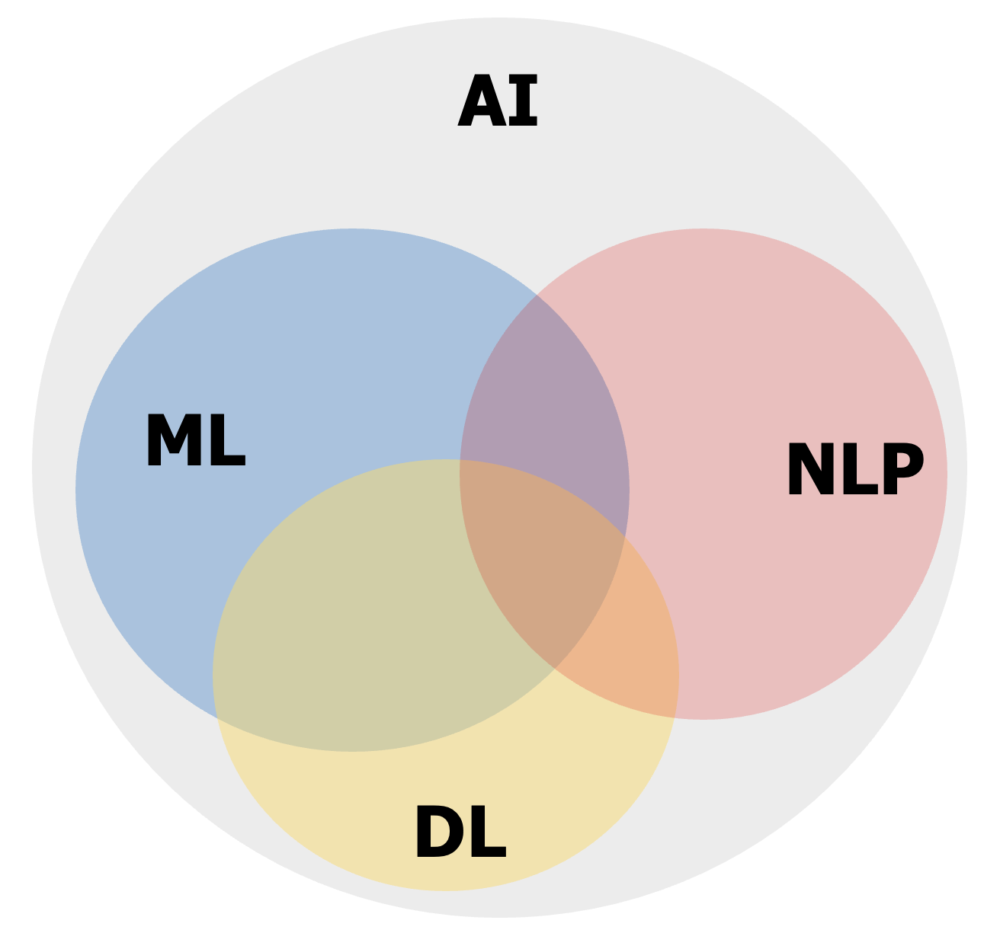

<section class="title">
  <div class="title-main">NLP and LLMs (CS40008.01)</div>
  <div class="title-sub">Lecture 01 – Introduction to NLP</div>

  <div class="title-meta">
    <div>Baojian Zhou</div>
    <div>NLP and LLMs (CS40008.01)</div>
    <div>School of Data Science, Fudan University</div>
    <div>03/05/2026</div>
  </div>
  
</section>

---

<section class="ppt">

  <div class="ppt-title">About me</div>
  <div class="ppt-line"></div>

  <p><b>Email:</b> bjzhou@fudan.edu.cn</p>
  <p><b>Course Website:</b> <a href="https://baojian.github.io/llm-26/" target="_blank" rel="noopener">https://baojian.github.io/llm-26/</a></p>
  <p><b>Course Github:</b> <a href="https://github.com/baojian/llm-26" target="_blank" rel="noopener">https://github.com/baojian/llm-26</a></p>
  <p><b>Location:</b> South-401, Computing Center</p>
  <p><b>Office hour:</b> Wed. 10:00am–11:30am</p>
  <p><b>Research interests:</b> Machine learning on graphs, optimization, text mining (e.g., word embeddings), diffusion models, and in-context learning on LLMs.</p>
</section>

---

<section class="ppt">
  <div class="ppt-title">Outline</div>
  <div class="ppt-line"></div>

  <ul class="outline-bullets big">
    <li class="active" data-fragment-index="1">Course introduction</li>
    <li class="muted" data-fragment-index="2">Basics for Python, nltk, spacy</li>
    <li class="muted" data-fragment-index="3">Tokenization</li>
    <li class="muted" data-fragment-index="4">Minimum edit distance</li>
  </ul>
</section>

---

<section class="ppt">
  <div class="ppt-title">What is natural language?</div>
  <div class="ppt-line"></div>
  
  **A structured system of communication used by humans**
  - 今天天气真好！
  - The weather is so nice today!
  - Le temps est vraiment beau aujourd’hui !

  **Formal Language (e.g., programming languages)**
  
  <div class="code-grid-3">
  <div class="cell">

  C<br>

  ```c
    #include<stdio.h>  
    int main(void){
      printf (“Hello, world!\n”);
      }
  ```
  </div>

  <div class="cell">

  Python<br>
  
  ```python
    def factorial(n: int) -> int:
      if n < 0:
          raise ValueError("n must be non-negative")
      result = 1
      for k in range(2, n + 1):
          result *= k
      return result
    print("5! =", factorial(5))
  ```
  </div>
  <div class="cell">

  Rust<br>

  ```rust
    fn factorial(n: u64) -> u64 {
      let mut result = 1;
      for k in 2..=n {
          result *= k;
      }
      result
    }
    fn main() {
        println!("5! = {}", factorial(5));
    }
  ```
  </div>
  
  </div>

</section>

---

<section class="ppt">
  <div class="ppt-title">Natural Language Processing (NLP)</div>
  <div class="ppt-line"></div>

- **NLP is focused on enabling computers to understand, interpret, and generate human language in a way that is both meaningful and useful.** 

- **Teach computers how to understand and generate human languages**
  - Natural Language <span class=fudanblue>Understanding</span>
  - Natural Language <span class=fudanblue>Generation</span>

</section>

---

<section class="ppt">
  <div class="ppt-title">Natural Language Processing (NLP)</div>
  <div class="ppt-line"></div>

  <div class="twocol" style="--left: 70%;">
    <div class="text">
        <li><b>NLP is focused on enabling computers to understand and generate human language in a way that is both meaningful and useful.</b></li>
        <li><b>Teach computers how to understand and generate human languages</b>
          <ul>
            <li>Natural Language <span class="fudanblue">Understanding</span></li>
            <li>Natural Language <span class="fudanblue">Generation</span></li>
          </ul>
        </li>
    </div>
    <div class="fig">
      
      <div class="cap">AI / ML / DL / NLP</div>
    </div>
  </div>
</section>

---

<section class="ppt">
  <div class="ppt-title">Ollama (Qwen3:1.7B)</div>
  <div class="ppt-line"></div>

  <iframe src="./ollama-demo.html"
          style="width:100%; height:620px; border:0; border-radius:12px;"></iframe>
</section>

---

<section class="ppt">
  <div class="ppt-title">LLM Chats</div>
  <div class="ppt-line"></div>

  <div class="link-grid">
    <a class="link-card" href="https://chat.openai.com/" target="_blank" rel="noopener noreferrer">
      <div class="link-name">ChatGPT</div>
      <div class="link-url">https://chat.openai.com/</div>
    </a>
    <a class="link-card" href="https://www.deepseek.com/" target="_blank" rel="noopener noreferrer">
      <div class="link-name">DeepSeek</div>
      <div class="link-url">https://www.deepseek.com/</div>
    </a>
    <a class="link-card" href="https://www.kimi.com/" target="_blank" rel="noopener noreferrer">
      <div class="link-name">Kimi</div>
      <div class="link-url">https://www.kimi.com/</div>
    </a>
    <a class="link-card" href="https://chat.qwen.ai/" target="_blank" rel="noopener noreferrer">
      <div class="link-name">Qwen Chat</div>
      <div class="link-url">https://chat.qwen.ai/</div>
    </a>
    <a class="link-card" href="https://gemini.google.com/app" target="_blank" rel="noopener noreferrer">
      <div class="link-name">Gemini</div>
      <div class="link-url">https://gemini.google.com/app</div>
    </a>
    <a class="link-card" href="https://www.together.ai/" target="_blank" rel="noopener noreferrer">
      <div class="link-name">Together.ai</div>
      <div class="link-url">https://www.together.ai/</div>
    </a>
    <a class="link-card" href="https://claude.com/product/claude-code" target="_blank" rel="noopener noreferrer">
      <div class="link-name">Claude Code</div>
      <div class="link-url">https://claude.com/product/claude-code</div>
    </a>
    <a class="link-card" href="https://www.doubao.com/chat/" target="_blank" rel="noopener noreferrer">
      <div class="link-name">Dou Bao</div>
      <div class="link-url">https://www.doubao.com/chat/</div>
    </a>
  </div>
  <div class="link-tip">Click any card to open in a new tab.</div>
</section>

---

<section class="ppt">
  <div class="ppt-title">NLP history (1947-1969)</div>
  <div class="ppt-line"></div>

  <div class="twocol" style="--left: 65%;">
    <div class="text">
      <li><b>Warren Weaver wrote to Wiener in 1947</b></li>
        <ul>
            <li><span class="fudanblue"> ... When I look at an article in Russian, I say: "This is really written in English, but it has been coded in some strange symbols. I will now proceed to decode." ...</span></li>
        </ul>
        <li><b>Alan Turing wrote "Computing Machinery and Intelligence" in 1950 (proposed the Turing test)</b>
          <ul>
            <li><span class="fudanblue">... I propose to consider the question, "Can machines think?" This should begin with definitions of the meaning of the terms "machine" and "think." ...</span></li>
          </ul>
        </li>
    </div>
    <div class="fig">
      
      <div class="cap" style="margin:0 auto 44px">Warren Weaver, 1894-1978</div>
      
      <div class="cap">Alan Turing, 1912-1954</div>
    </div>
  </div>

  </div>
</section>

---

<section class="ppt">
  <div class="ppt-title">Tasks – Sentiment Analysis</div>
  <div class="ppt-line"></div>

  <div class="twocol" style="--left: 40%;">
    <!-- LEFT: examples -->
    <div class="sa-left">
      <div class="sa-hint">Click an example:</div>
      <button class="sa-ex" data-text="Nice and compact to carry!">
        ✅ Nice and compact to carry!
      </button>
      <button class="sa-ex" data-text="Since the camera is small and light, I won't need to carry around those heavy, bulky professional cameras either!">
        ✅ Since the camera is small and light, I won't need to carry around those heavy, bulky professional cameras either!
      </button>
      <button class="sa-ex" data-text="The camera feels flimsy, is plastic and very light in weight you have to be very delicate in the handling of this camera.">
        ❌ The camera feels flimsy, is plastic and very light in weight you have to be very delicate in the handling of this camera.
      </button>
    </div>
    <!-- RIGHT: ollama demo -->
    <div class="sa-right">
      <iframe
        id="ollamaFrame"
        src="./ollama-sentiment-analysis.html?task=sentiment"
        style="width:100%; height:620px; border:0; border-radius:12px;">
      </iframe>
    </div>
  </div>
</section>

---

<section class="ppt">
  <div class="ppt-title">Task – Machine Translation (ZH → EN)</div>
  <div class="ppt-line"></div>

  <div class="twocol" style="--left: 42%;">
    <!-- LEFT: examples -->
    <div class="mt-left">
      <div class="sa-hint">Click an example (Chinese source):</div>
      <button class="sa-ex" data-text="Google Translate支持249种语言。日均用户超过2亿人，2016年4月总用户数超过5亿人，每天翻译超过1000亿个单词。">
        Example 1: Google Translate (stats)
      </button>
      <button class="sa-ex" data-text="人工智能亦称智械、机器智能，指由人制造出来的机器所表现出来的智能。通常人工智能是指通过普通计算机程序来呈现人类智能的技术。该词也指出研究这样的智能系统是否能够实现，以及如何实现。同时，通过医学、神经科学、机器人学及统计学等的进步，常态预测则认为人类的很多职业也逐渐被其取代。">
        Example 2: AI definition (encyclopedic)
      </button>
    </div>
    <!-- RIGHT: ollama -->
    <div class="mt-right">
      <iframe
        id="ollamaFrameMT"
        src="./ollama-machine-translation.html?task=translate&src=zh&tgt=en"
        style="width:100%; height:620px; border:0; border-radius:12px;">
      </iframe>
    </div>
  </div>
</section>

---

<section class="ppt">
  <div class="ppt-title">Outline</div>
  <div class="ppt-line"></div>

  <ul class="outline-bullets big">
    <li class="muted" data-fragment-index="1">Course introduction</li>
    <li class="active" data-fragment-index="2">Basics for Python, nltk, spacy</li>
    <li class="muted" data-fragment-index="3">Tokenization</li>
    <li class="muted" data-fragment-index="4">Minimum edit distance</li>
  </ul>
</section>

---

<section class="ppt">
  <div class="ppt-title">Outline</div>
  <div class="ppt-line"></div>

  <ul class="outline-bullets big">
    <li class="muted" data-fragment-index="1">Course introduction</li>
    <li class="muted" data-fragment-index="2">Basics for Python, nltk, spacy</li>
    <li class="active" data-fragment-index="3">Tokenization</li>
    <li class="muted" data-fragment-index="4">Minimum edit distance</li>
  </ul>
</section>

---

<section class="ppt">
  <div class="ppt-title">Outline</div>
  <div class="ppt-line"></div>

  <ul class="outline-bullets big">
    <li class="muted" data-fragment-index="1">Course introduction</li>
    <li class="muted" data-fragment-index="2">Basics for Python, nltk, spacy</li>
    <li class="muted" data-fragment-index="3">Tokenization</li>
    <li class="active" data-fragment-index="4">Minimum edit distance</li>
  </ul>
</section>