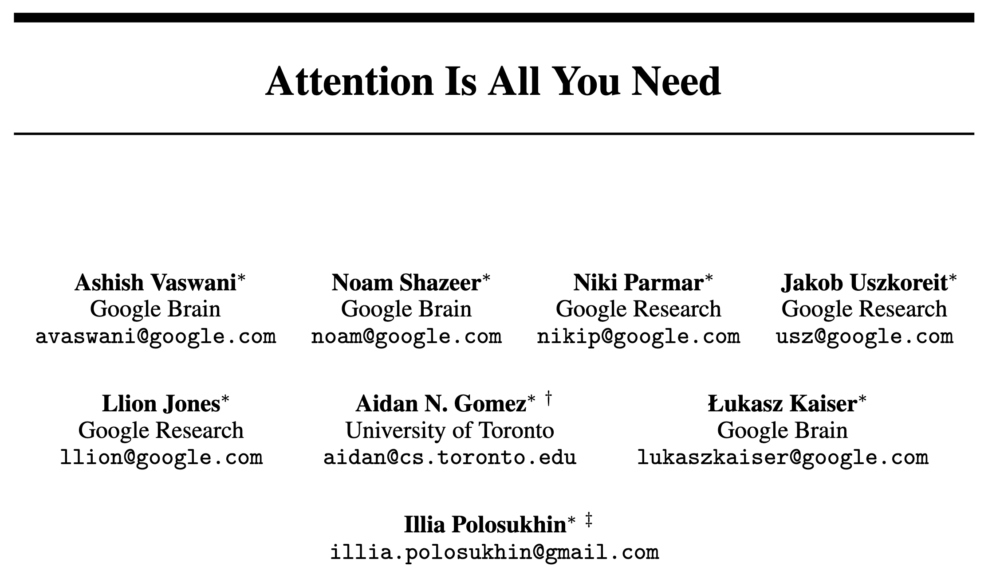

<section class="title">
  <div class="title-main">NLP and LLMs (CS40008.01)</div>
  <div class="title-sub">Lecture 01 – Introduction to NLP</div>

  <div class="title-meta">
    <div>Baojian Zhou</div>
    <div>NLP and LLMs (CS40008.01)</div>
    <div>School of Data Science, Fudan University</div>
    <div>03/05/2026</div>
  </div>
  
</section>

---

<section class="ppt">

  <div class="ppt-title">About me</div>
  <div class="ppt-line"></div>

  <p><b>Email:</b> bjzhou@fudan.edu.cn</p>
  <p><b>Course Website:</b> <a href="https://baojian.github.io/llm-26/" target="_blank" rel="noopener">https://baojian.github.io/llm-26/</a></p>
  <p><b>Course Github:</b> <a href="https://github.com/baojian/llm-26" target="_blank" rel="noopener">https://github.com/baojian/llm-26</a></p>
  <p><b>Location:</b> South-401, Computing Center</p>
  <p><b>Office hour:</b> Wed. 10:00am–11:30am</p>
  <p><b>Research interests:</b> Machine learning on graphs, optimization, text mining (e.g., word embeddings), diffusion models, and in-context learning on LLMs.</p>
</section>

---

<section class="ppt">
  <div class="ppt-title">Outline</div>
  <div class="ppt-line"></div>
  
  <ul class="outline-bullets big">
  <li class="active">Course Overview</li>
  <li class="muted">Development of NLP & LLMs</li>
  <li class="muted">Basics for Text Preprocessing</li>
  <li class="muted">Text Tokenization</li>
  </ul>
</section>

---


<section class="ppt">
  <div class="ppt-title">What is natural language?</div>
  <div class="ppt-line"></div>
  
  **A structured system of communication used by humans**
  - 今天天气真好！
  - The weather is so nice today!
  - Le temps est vraiment beau aujourd’hui !

  **Formal Language (e.g., programming languages)**
  
  <div class="code-grid-3">
  <div class="cell">

  C<br>

  ```c
    #include<stdio.h>  
    int main(void){
      printf (“Hello, world!\n”);
      }
  ```
  </div>

  <div class="cell">

  Python<br>
  
  ```python
    def factorial(n: int) -> int:
      if n < 0:
          raise ValueError("n must be non-negative")
      result = 1
      for k in range(2, n + 1):
          result *= k
      return result
    print("5! =", factorial(5))
  ```
  </div>
  <div class="cell">

  Rust<br>

  ```rust
    fn factorial(n: u64) -> u64 {
      let mut result = 1;
      for k in 2..=n {
          result *= k;
      }
      result
    }
    fn main() {
        println!("5! = {}", factorial(5));
    }
  ```
  </div>
  
  </div>

</section>

---

<section class="ppt">
  <div class="ppt-title">Natural Language Processing (NLP)</div>
  <div class="ppt-line"></div>

  <div class="twocol" style="--left: 57%;">
    <div class="text">
      <div style="font-size:40px; line-height:1.35; font-weight:800;">
        NLP focuses on enabling computers to <span style="color:#d00;">understand</span> and <span style="color:#d00;">generate</span> text-based language in a way that is meaningful and useful: <span class="fudanblue">we care about language understanding and generation</span>.
      </div>
      <ul style="margin-top:20px; font-size:36px; line-height:1.45;">
        <li>Techniques developed in NLP can also be applied to code and other sequential data.</li>
      </ul>
    </div>
    <div class="fig">
      
    </div>
  </div>

  <div class="fragment" style="margin-top:10px; font-size:40px; font-weight:800;">
  <span style="color:#d00;">
    Modern LLMs are large neural models trained on massive text corpora to learn patterns in data and generalize across many NLP tasks.
  </span>
  </div>
</section>

---

<section class="ppt">
  <div class="ppt-title">Example of LLMs (Use Qwen-series)</div>
  <div class="ppt-line"></div>

  <iframe
    src="./ollama-think-demo.html?modelSel=qwen3:0.6b&think=true&top_logprobs=20"
    style="width:100%; height:620px; border:0; border-radius:12px;">
  </iframe>
</section>

---

<section class="ppt">
  <div class="ppt-title">Tasks – Sentiment Analysis</div>
  <div class="ppt-line"></div>

  <div class="twocol" style="--left: 40%;">
    <!-- LEFT: examples -->
    <div class="sa-left">
      <div class="sa-hint">Click an example:</div>
      <button class="sa-ex" data-text="Nice and compact to carry!">
        ✅ Nice and compact to carry!
      </button>
      <button class="sa-ex" data-text="Since the camera is small and light, I won't need to carry around those heavy, bulky professional cameras either!">
        ✅ Since the camera is small and light, I won't need to carry around those heavy, bulky professional cameras either!
      </button>
      <button class="sa-ex" data-text="The camera feels flimsy, is plastic and very light in weight you have to be very delicate in the handling of this camera.">
        ❌ The camera feels flimsy, is plastic and very light in weight you have to be very delicate in the handling of this camera.
      </button>
    </div>
    <!-- RIGHT: ollama demo -->
    <div class="sa-right">
      <iframe
        id="ollamaFrame"
        src="./ollama-sentiment-analysis.html?task=sentiment"
        style="width:100%; height:620px; border:0; border-radius:12px;">
      </iframe>
    </div>
  </div>
</section>

---

<section class="ppt">
  <div class="ppt-title">Task – Machine Translation (ZH → EN)</div>
  <div class="ppt-line"></div>

  <div class="twocol" style="--left: 42%;">
    <!-- LEFT: examples -->
    <div class="mt-left">
      <div class="sa-hint">Click an example (Chinese source):</div>
      <button class="sa-ex" data-text="Google Translate支持249种语言。日均用户超过2亿人，2016年4月总用户数超过5亿人，每天翻译超过1000亿个单词。">
        Example 1: Google Translate (stats)
      </button>
      <button class="sa-ex" data-text="人工智能亦称智械、机器智能，指由人制造出来的机器所表现出来的智能。通常人工智能是指通过普通计算机程序来呈现人类智能的技术。该词也指出研究这样的智能系统是否能够实现，以及如何实现。同时，通过医学、神经科学、机器人学及统计学等的进步，常态预测则认为人类的很多职业也逐渐被其取代。">
        Example 2: AI definition (encyclopedic)
      </button>
    </div>
    <!-- RIGHT: ollama -->
    <div class="mt-right">
      <iframe
        id="ollamaFrameMT"
        src="./ollama-machine-translation.html?task=translate&src=zh&tgt=en"
        style="width:100%; height:620px; border:0; border-radius:12px;">
      </iframe>
    </div>
  </div>
</section>

---

<section class="ppt">
  <div class="ppt-title">Task – Article Generation</div>
  <div class="ppt-line"></div>

  <div class="twocol" style="--left: 43%;">
    <!-- LEFT -->
    <div class="art-card">
      <div class="art-head">A · Blog</div>
      <div class="art-body">
        <div class="art-k">Title: Feeling unproductive? Maybe you should stop overthinking.</div>
        <div class="art-k" style="margin-top:10px;">Content:</div>
        <div class="art-v">
          In order to get something done, maybe we need to think less. Seems counter-intuitive,
          but I believe sometimes our thoughts can get in the way of the creative process.
          We can work better at times when we "tune out" the external world and focus on what's
          in front of us. I've been thinking about this lately, so I thought it would be good
          to write an article about it…
        </div>
      </div>
    </div>
    <!-- RIGHT -->
    <div class="art-card">
      <div class="art-head">B · News article</div>
      <div class="art-body">
        <div class="art-k">Title: United Methodists Agree to Historic Split</div>
        <div class="art-v"></div>
        <div class="art-k" style="margin-top:10px;">Content:</div>
        <div class="art-v">
          After two days of intense debate, the United Methodist Church has agreed to a historic split —
          one that is expected to end in the creation of a new denomination, one that will be
          “theologically and socially conservative,” according to The Washington Post. The majority of
          delegates attending the church‘s annual General Conference in May voted to strengthen a ban on
          the ordination of LGBTQ clergy and to write new rules that will “discipline” clergy who officiate
          at same-sex weddings. But those who opposed these measures have a new plan…
        </div>
      </div>
    </div>
  </div>

  <div class="quiz-row">
    <button class="quiz-btn">1) A: Human · B: Human</button>
    <button class="quiz-btn">2) A: Machine · B: Human</button>
    <button class="quiz-btn">3) A: Human · B: Machine</button>
    <button class="quiz-btn" data-fragment-index="1">4) A: Machine · B: Machine</button>
  </div>

  <div class="quiz-hint fragment" data-fragment-index="1">
    <b>Correct answer: 4)</b>. They are all generated by GPT-3!
  </div>
</section>

---

<section class="ppt">
  <div class="ppt-title">Task – Image Understanding</div>
  <div class="ppt-line"></div>

  <div class="twocol" style="--left: 40%;">
    <!-- LEFT: images + model selector -->
    <div>
      <div style="display:flex; gap:10px; align-items:center; margin: 0 0 10px 0;">
        <div style="font-weight:900; font-size:22px;">Model:</div>
        <select id="vlModel" style="font-size:18px; padding:8px 10px; border-radius:10px; border:1px solid #cfcfcf;">
          <option value="qwen3-vl:2b">qwen3-vl:2b</option>
          <option value="qwen3-vl:4b">qwen3-vl:4b</option>
        </select>
      </div>
      <div class="vl-thumbs">
        <button class="vl-thumb selected" data-img="media/ppt/media/image41.jpg" aria-label="Select image 41">
          
          <div class="cap">Click: Describe this image</div>
        </button>
        <button class="vl-thumb" data-img="media/ppt/media/image32.png" aria-label="Select image 32">
          
          <div class="cap">Click: Describe this image</div>
        </button>
      </div>
    </div>
    <!-- RIGHT: ollama VLM UI -->
    <div class="sa-right">
      <iframe
        id="vlFrame"
        src="./ollama-vl-demo.html?img=media/ppt/media/image41.jpg&model=qwen3-vl:2b"
        style="width:100%; height:620px; border:0; border-radius:12px;">
      </iframe>
    </div>
  </div>
</section>

---

<section class="ppt">
  <div class="ppt-title">Task – Text → Image (Stable Diffusion)</div>
  <div class="ppt-line"></div>
  <iframe
    src="./sd-demo.html"
    style="width:100%; height:600px; border:0; border-radius:12px; background:#fff;">
  </iframe>
</section>

---

<section class="ppt">
  <div class="ppt-title">Task – Text → Video</div>
  <div class="ppt-line"></div>

  <div class="twocol" style="--left: 49%; gap: 22px;">
    <!-- LEFT -->
    <div>
      <div style="font-size:22px; line-height:1.35; margin-top:6px;">
        <b>Creating video from text:</b><br>
        <span class="fudanblue">
          an old man wearing blue jeans and a white T-shirt taking a pleasant stroll in Antarctica during a winter storm
        </span>
      </div>
      <div style="height:40px;"></div>
      <video
        data-src="media/ppt/media/text-to-video.mp4"
        controls autoplay muted loop playsinline
        preload="metadata"
        style="width:100%; max-height:420px; height:auto; border-radius:12px; background:#000;">
      </video>
    </div>
    <!-- RIGHT -->
    <div>
      <div style="font-size:22px; line-height:1.35; margin-top:6px;">
        <b>Creating video from text:</b><br>
        <span class="fudanblue">
          a woman wearing purple overalls and cowboy boots taking a pleasant stroll in Johannesburg South Africa during a beautiful sunset
        </span>
      </div>
      <div style="height:40px;"></div>
      <video
        data-src="media/ppt/media/text-to-video-woman.mp4"
        controls autoplay muted loop playsinline
        preload="metadata"
        style="width:100%; max-height:420px; height:auto; border-radius:12px; background:#000;">
      </video>
    </div>
  </div>
</section>

---

<section class="ppt">
  <div class="ppt-title">Many Other NLP Tasks & Products</div>
  <div class="ppt-line"></div>

  <!-- Row 1: wide image -->
  <div style="display:flex; justify-content:center; margin-top:10px;">
    
  </div>

  <div style="height:14px;"></div>

  <!-- Row 2: three images -->
  <div style="display:grid; grid-template-columns: 1fr 1fr 1fr; gap:14px; align-items:center;">
    
    
    
  </div>
</section>

---

<section class="ppt">
  <div class="ppt-title">Many Other LLMs</div>
  <div class="ppt-line"></div>

  <div class="link-grid">
    <a class="link-card" href="https://chat.openai.com/" target="_blank" rel="noopener noreferrer">
      <div class="link-name">ChatGPT</div>
      <div class="link-url">https://chat.openai.com/</div>
    </a>
    <a class="link-card" href="https://www.deepseek.com/" target="_blank" rel="noopener noreferrer">
      <div class="link-name">DeepSeek</div>
      <div class="link-url">https://www.deepseek.com/</div>
    </a>
    <a class="link-card" href="https://www.kimi.com/" target="_blank" rel="noopener noreferrer">
      <div class="link-name">Kimi</div>
      <div class="link-url">https://www.kimi.com/</div>
    </a>
    <a class="link-card" href="https://chat.qwen.ai/" target="_blank" rel="noopener noreferrer">
      <div class="link-name">Qwen Chat</div>
      <div class="link-url">https://chat.qwen.ai/</div>
    </a>
    <a class="link-card" href="https://gemini.google.com/app" target="_blank" rel="noopener noreferrer">
      <div class="link-name">Gemini</div>
      <div class="link-url">https://gemini.google.com/app</div>
    </a>
    <a class="link-card" href="https://www.together.ai/" target="_blank" rel="noopener noreferrer">
      <div class="link-name">Together.ai</div>
      <div class="link-url">https://www.together.ai/</div>
    </a>
    <a class="link-card" href="https://claude.com/product/claude-code" target="_blank" rel="noopener noreferrer">
      <div class="link-name">Claude Code</div>
      <div class="link-url">https://claude.com/product/claude-code</div>
    </a>
    <a class="link-card" href="https://www.doubao.com/chat/" target="_blank" rel="noopener noreferrer">
      <div class="link-name">Dou Bao</div>
      <div class="link-url">https://www.doubao.com/chat/</div>
    </a>
  </div>
  <div class="link-tip">Click any card to open in a new tab.</div>
</section>

---

<section class="ppt">
  <div class="ppt-title">Key Questions (This Course Will Answer)</div>
  <div class="ppt-line"></div>

  <ul class="outline-bullets" style="margin-top:14px; font-size:34px; line-height:1.55;">
    <li class="fragment"><b>How are LLMs built?</b> <span style="opacity:.85;">Pre-training = next-token prediction</span></li>
    <li class="fragment"><b>What is the “thinking step”?</b> <span style="opacity:.85;">Post-training with SFT + RL</span></li>
    <li class="fragment"><b>Why can one model do many tasks?</b> <span style="opacity:.85;">In-context learning + generalization</span></li>
    <li class="fragment"><b>How can we make LLMs fast?</b> <span style="opacity:.85;">Efficient decoding + systems + compression</span></li>
    <li class="fragment"><b>How to use LLMs smartly?</b> <span style="opacity:.85;">Tools, planning, and LLM agents</span></li>
    <li class="fragment"><b>Are my questions and data safe?</b> <span style="opacity:.85;">Privacy + security + safety alignment</span></li>
    <li class="fragment"><b>Are there alternatives to AR LLMs?</b> <span style="opacity:.85;">Diffusion Language Models</span></li>
    <li class="fragment"><b>How do we know if an LLM is good?</b> <span style="opacity:.85;">Benchmarks, robustness, hallucinations</span></li>
    <li class="fragment"><b>How do we make LLM outputs reliable with knowledge/tools?</b> <span style="opacity:.85;">RAG, citations, verification</span></li>
    <li class="fragment"><b>How do we adapt LLMs to a domain and beyond text?</b> <span style="opacity:.85;">Fine-tuning + Multimodality</span></li>
  </ul>

  <div class="fragment" style="margin-top:5px; font-size:26px; opacity:.8;">
    We will focus on these questions throughout the semester.
  </div>
</section>

---

<section class="ppt">
  <div class="ppt-title">What We Will Cover (Tentative)</div>
  <div class="ppt-line"></div>

  <div class="twocol" style="--left: 52%;">
    <!-- LEFT -->
    <div style="font-size:40px; line-height:1.5; margin-top:6px;">
      <div style="font-weight:900; color:#1f4e9a;">Basics</div>
      <div style="height:5px;"></div>
      <ul style="margin:0;">
        <li>Text pre-processing & tokenization</li>
        <li>Language models (N-grams)</li>
        <li>Word embeddings (word2vec)</li>
        <li>Neural networks for LMs</li>
        <li>RNNs for sequence labeling</li>
        <li>Self-attention mechanism</li>
        <li>Transformer architecture</li>
      </ul>
    </div>
    <!-- RIGHT -->
    <div style="font-size:40px; line-height:1.5; margin-top:6px;">
      <div style="font-weight:900; color:#1f4e9a;">LLMs</div>
      <div style="height:5px;"></div>
      <ul style="margin:0;">
        <li>Pretraining & fine-tuning</li>
        <li>Evaluation & benchmarking</li>
        <li>In-context learning</li>
        <li>Reasoning & agents</li>
        <li>Diffusion language models</li>
      </ul>
      <div style="height:14px;"></div>
      <div style="font-weight:900; color:#1f4e9a;">Applications</div>
      <div style="height:5px;"></div>
      <ul style="margin:0;">
        <li>Machine translation</li>
        <li>Syntactic analysis</li>
      </ul>
    </div>
  </div>
</section>

---

<section class="ppt">
  <div class="ppt-title">More Materials Beyond This Course</div>
  <div class="ppt-line"></div>

  <div class="twocol" style="--left: 52%; margin-top:10px;">
    <!-- LEFT: textbooks + conferences -->
    <div class="text" style="font-size:28px; line-height:1.45;">
      <div style="font-weight:900; color:#1f4e9a;">Textbooks / Notes</div>
      <div style="height:6px;"></div>
      <ul style="margin:0; padding-left:1.1em;">
        <li>Jurafsky &amp; Martin, <div style="height:5px;"></div><a href="https://web.stanford.edu/~jurafsky/slp3/" target="_blank" rel="noopener"><i>Speech and Language Processing</i> (3rd ed. draft)</a>
        </li>
        <li>Tong Xiao &amp Jingbo Zhu<div style="height:5px;"></div><a href="https://arxiv.org/pdf/2501.09223" target="_blank" rel="noopener"><i>Foundations of Large Language Models</i></a>
        </li>
        <li>Jacob Eisenstein, <i>Natural Language Processing</i> (2018)</li>
        <li>
          张奇、桂韬、黄萱菁，《
          <a href="https://intro-nlp.github.io/" target="_blank" rel="noopener">
            自然语言处理导论</a>》
        </li>
      </ul>
      <div style="height:14px;"></div>
      <div style="font-weight:900; color:#1f4e9a;">Conferences &amp; Paper Hub</div>
      <div style="height:6px;"></div>
      <ul style="margin:0; padding-left:1.1em;">
        <li><b>NLP:</b> ACL, EMNLP, NAACL, EACL, COLING — ACL Anthology</li>
        <li><b>ML:</b> NeurIPS, ICML, ICLR</li>
        <li><b>IR:</b> SIGIR, WWW, WSDM, CIKM</li>
        <li><b>Data mining:</b> KDD (plus many great blogs)</li>
      </ul>
    </div>
    <!-- RIGHT: courses -->
    <div class="fig" style="font-size:28px; line-height:1.45;">
      <div style="font-weight:900; color:#1f4e9a;">High-quality Courses</div>
      <div style="height:6px;"></div>
      <ul style="margin:0; padding-left:1.1em;">
        <li>Stanford CS336: Language Modeling from Scratch (Percy Liang)</li>
        <li>Stanford CS224N: Deep Learning for NLP (Christopher Manning)</li>
        <li>CMU 11-711: Advanced NLP (Graham Neubig)</li>
        <li>UMass CS685: Advanced NLP (Mohit Iyyer)</li>
        <li>Princeton COS 484: NLP (Danqi Chen)</li>
        <li>Karpathy: Neural Networks: Zero to Hero</li>
        <li>Stanford CS124: From Languages to Information (Jurafsky)</li>
      </ul>
      <div style="height:14px;"></div>
      <div style="font-size:22px; opacity:.8;">
        Tip: pick <b>one textbook</b> + <b>one course</b> as your long-term companion.
      </div>
    </div>
  </div>
</section>

---

<section class="ppt">
  <div class="ppt-title">Coursework</div>
  <div class="ppt-line"></div>

  <div style="font-size:24px; opacity:.85; margin-top:8px;">
    Open in a new tab:
    <a href="https://baojian.github.io/llm-26/index.html" target="_blank" rel="noopener">
      baojian.github.io/llm-26/index.html
    </a>
  </div>
  <div style="height:10px;"></div>
  <div style="
    height:560px;            /* ✅ fixed window height */
    border:2px solid rgba(0,0,0,0.12);
    border-radius:16px;
    overflow:hidden;         /* ✅ keep page inside the box */
    background:#fff;
    box-shadow:0 10px 22px rgba(0,0,0,0.10);
  ">
    <iframe
      src="https://baojian.github.io/llm-26/index.html"
      style="width:100%; height:100%; border:0;">
    </iframe>
  </div>

  <div style="margin-top:10px; font-size:18px; opacity:.75;">
    If the embedded page is blocked by browser security, click the link above to open in a new tab.
  </div>
</section>

---

<section class="ppt">
  <div class="ppt-title">Course Materials</div>
  <div class="ppt-line"></div>

  <div class="twocol" style="--left: 40%;">
    <!-- LEFT -->
    <div style="font-size:30px; line-height:1.55; margin-top:10px;">
      <div style="font-weight:900; color:#1f4e9a;">Where to find everything</div>
      <div style="height:5px;"></div>
      <ul style="margin:0;">
        <li>All lectures have slides + exercises</li>
        <li>Use GitHub to access source files</li>
        <li>Use the course website for learning</li>
      </ul>
    </div>
    <!-- RIGHT -->
    <div style="font-size:30px; line-height:1.45; margin-top:10px;">
      <div style="font-weight:900; color:#1f4e9a;">Course Materials Hub</div>
      <div style="height:5px;"></div>
      <div style="border:2px solid rgba(0,0,0,0.12); border-radius:14px; padding:14px 16px; background:#f6f7f9;">
        <div style="height:10px;"></div>
        <div style="font-weight:900;">GitHub Repo: <a href="https://github.com/baojian/llm-26" target="_blank" rel="noopener">https://github.com/baojian/llm-26</a>
        </div>
        <div style="height:10px;"></div>
        <div style="font-weight:900;">Course Website / Slides: <a href="https://baojian.github.io/llm-26/" target="_blank" rel="noopener">https://baojian.github.io/llm-26/</a>
        </div>
        <div style="height:10px;"></div>
        <div style="font-weight:900;">Jupyter Notebooks: (each lecture)</div>
      </div>
    </div>
  </div>
  <div style="height:100px;"></div>
  <div style="font-size:22px; line-height:1.45; opacity:0.9; border:2px solid rgba(0,0,0,0.12);
              border-radius:14px; padding:12px 14px; background:#f6f7f9;">
    <div style="font-weight:900; color:#1f4e9a;">Tip: weekly updates</div>
    <div style="height:5px;"></div>
    Each lecture will be updated weekly. You can fetch the latest materials by running:
    <div style="height:5px;"></div>
    <pre style="margin:0; padding:10px 12px; border-radius:12px; background:#fff; border:1px solid #ddd; font-size:18px; line-height:1.35;">
    cd llm-26
    git pull
    </pre>
  </div>
</section>

---

<section class="ppt">
  <div class="ppt-title">How to Learn This Course Effectively</div>
  <div class="ppt-line"></div>

  <div class="twocol" style="--left: 62%;">
    <!-- LEFT -->
    <div style="font-size:40px; line-height:1.55; margin-top:8px;">
      <div style="font-weight:900; color:#1f4e9a;">Skills needed</div>
      <div style="height:5px;"></div>
      <ul style="margin:0;">
        <li><b>Linear algebra</b> (vectors, matrices)</li>
        <li><b>Basic statistics / ML</b> (probability, optimization)</li>
        <li><b>Python</b> (NumPy, PyTorch, Transformers)</li>
        <li><b>Communication</b> (team project, presentation)</li>
      </ul>
      <div style="height:10px;"></div>
      <div style="font-size:22px; opacity:0.75;">
        Strategy: <b>read → implement → experiment → explain</b>
      </div>
    </div>
    <!-- RIGHT: diagram -->
    <div class="skill-map">
      <div class="skill-center">NLP & LLMs</div>
      <div class="skill-node n1">Linear algebra</div>
      <div class="skill-node n2">Statistics / ML</div>
      <div class="skill-node n3">Python (NumPy / PyTorch)</div>
      <div class="skill-node n4">Communication</div>
    </div>
  </div>
</section>

---

<section class="ppt">
  <div class="ppt-title">Outline</div>
  <div class="ppt-line"></div>
  
  <ul class="outline-bullets big">
  <li class="muted">Course Overview</li>
  <li class="active">Development of NLP & LLMs</li>
  <li class="muted">Basics for Text Preprocessing</li>
  <li class="muted">Text Tokenization</li>
  </ul>
</section>

---

<!-- Slide 1: Ambiguity -->
<section class="ppt">
  <div class="ppt-title">Why NLP Was Hard (Pre-LLMs): Ambiguity</div>
  <div class="ppt-line"></div>

  <div class="twocol" style="--left: 46%;">
    <!-- LEFT -->
    <div class="text">
      <ul class="outline-bullets" style="margin-top:10px;">
        <li class="fragment"><b>Ambiguity is everywhere</b>: the same words/structure can mean different things.</li>
        <li class="fragment"><b>Syntax ambiguity</b> (who did what to whom?)</li>
        <li class="fragment"><b>Semantic / pragmatic ambiguity</b> (what is implied?)</li>
        <li class="fragment"><b>Cross-lingual ambiguity</b> exists in both English and Chinese.</li>
      </ul>
      <div class="fragment" style="margin-top:18px; font-size:26px; opacity:.85;">
        Pre-LLM pipelines relied on handcrafted rules/features → brittle under ambiguity.
      </div>
    </div>
    <!-- RIGHT -->
    <div class="fig">
      <div style="
        border:2px solid rgba(0,0,0,0.10);
        border-radius:16px;
        padding:16px 18px;
        background:rgba(255,255,255,0.92);
        box-shadow:0 10px 22px rgba(0,0,0,0.08);
        font-size:26px;
        line-height:1.35;
      ">
        <div style="font-weight:900; color:#1f4e9a; margin-bottom:10px;">English examples</div>
        <div class="fragment" style="margin-bottom:10px;">
          “A man saw a boy <b>with a telescope</b>.”<br/>
          <span style="opacity:.8;">Who had the telescope?</span>
        </div>
        <div class="fragment" style="margin-bottom:10px;">
          What does the Mighty Dragon mean？<br/>
          <span style="opacity:.8;">Mighty Dragon has multiple meanings.</span>
        </div>
        <div class="fragment" style="margin-bottom:10px;">
          “He has <b>quit smoking</b>.”<br/>
          <span style="opacity:.8;">It implies he smoked before.</span>
        </div>
        <div class="fragment" style="font-weight:900; color:#1f4e9a; margin:14px 0 8px;">Chinese examples</div>
        <div class="fragment" style="opacity:.92;">
          冬天，能穿多少穿多少；夏天，能穿多少穿多少；
        </div>
      </div>
    </div>
  </div>
</section>

---

<!-- Slide 2: Beyond ambiguity -->
<section class="ppt">
  <div class="ppt-title">Why NLP Was Hard: Messy Text / Reasoning</div>
  <div class="ppt-line"></div>

  <div class="twocol" style="--left: 65%;">
    <!-- LEFT -->
    <div class="text">
      <ul class="outline-bullets" style="margin-top:10px; font-size:26px; line-height:1.5;">
        <li style="margin:10px 0; class="fragment"><b>Non-standard text</b><br/> social media spelling, emojis, hashtags, code-switching.</li>
        <li style="margin:10px 0; class="fragment"><b>Segmentation</b><br/> what is a “word”? (esp. for Chinese / noisy text)</li>
        <li style="margin:10px 0; class="fragment"><b>Idioms & figurative language</b><br/> meaning ≠ literal words.</li>
        <li style="margin:10px 0; class="fragment"><b>Neologisms</b><br/> new words appear faster than rules/dictionaries.</li>
        <li style="margin:10px 0; class="fragment"><b>Entity names</b><br/> titles vs common words (“Let It Be”, “A Bug’s Life”).</li>
        <li style="margin:10px 0; class="fragment"><b>World knowledge</b><br/> understanding requires facts beyond the sentence.</li>
        <li style="margin:10px 0; class="fragment"><b>Reasoning pitfalls</b><br/> valid form ≠ valid meaning (adversarial examples).</li>
      </ul>
    </div>
    <!-- RIGHT -->
    <div class="fig">
      <div style="
        border:2px solid rgba(0,0,0,0.10);
        border-radius:16px;
        padding:16px 18px;
        background:rgba(255,255,255,0.92);
        box-shadow:0 10px 22px rgba(0,0,0,0.08);
        font-size:25px;
        line-height:1.35;
      ">
        <div style="font-weight:900; color:#1f4e9a; margin-bottom:10px;">Non-standard text</div>
        <div class="fragment" style="opacity:.95; margin-bottom:12px;">
          Great job @justinbieber! Were SOO PROUD of what youve accomplished!<br/>
          U taught us 2 #neversaynever ...
        </div>
        <div style="font-weight:900; color:#1f4e9a; margin:10px 0 8px;">Idioms / neologisms</div>
        <div class="fragment" style="opacity:.95; margin-bottom:12px;">
           · dark horse · lose face · break a leg <br/>
           · bite the bullet · unfriend <br/>
           · Retweet · bromance · 鸡娃
        </div>
        <div style="font-weight:900; color:#1f4e9a; margin:10px 0 8px;">Reasoning trap</div>
        <div class="fragment" style="opacity:.95;">
          A penny is better than nothing.<br/>
          Nothing is better than world peace.<br/>
          Therefore, a penny is better than world peace ??? 
        </div>
      </div>
    </div>

  </div>
</section>

---

<section class="ppt">
  <div class="ppt-title">NLP history (1947–1969)</div>
  <div class="ppt-line"></div>

  <div class="twocol" style="--left: 65%;">
    <div class="text">
      <li><b>Warren Weaver wrote to Wiener in 1947</b></li>
        <ul>
            <li><span class="fudanblue"> ... When I look at an article in Russian, I say: "This is really written in English, but it has been coded in some strange symbols. I will now proceed to decode." ...</span></li>
        </ul>
        <li><b>Alan Turing wrote "Computing Machinery and Intelligence" in 1950 (proposed the Turing test)</b>
          <ul>
            <li><span class="fudanblue">... I propose to consider the question, "Can machines think?" This should begin with definitions of the meaning of the terms "machine" and "think." ...</span></li>
          </ul>
        </li>
    </div>
    <div class="fig">
      
      <div class="cap" style="margin:0 auto 44px">Warren Weaver, 1894-1978</div>
      
      <div class="cap">Alan Turing, 1912-1954</div>
    </div>
  </div>

  </div>
</section>

---

<section class="ppt">
  <div class="ppt-title">NLP history (1947–1969)</div>
  <div class="ppt-line"></div>

  <div class="twocol" style="--left: 50%; margin-top:6px;">
    <!-- LEFT: Turing test diagram (dynamic) -->
    <div class="text">
      <div style="font-size:34px; font-weight:900; text-align:center; margin:6px 0 8px 0;">
        Turing test </br> (A=machine, B=human, C=judge)
      </div>
      <svg viewBox="0 0 720 440" style="width:100%; height:auto;">
        <!-- Divider -->
        <line x1="360" y1="60" x2="360" y2="265" stroke="rgba(0,0,0,0.35)" stroke-width="4"
              class="fragment" data-fragment-index="2"></line>
        <!-- ====== A (machine) ====== -->
        <g class="fragment" data-fragment-index="1">
          <rect x="110" y="90" width="150" height="120" rx="18" fill="#fff" stroke="rgba(0,0,0,0.35)" stroke-width="4"></rect>
          <rect x="125" y="105" width="120" height="85" rx="10" fill="rgba(31,78,154,0.06)" stroke="rgba(0,0,0,0.12)" stroke-width="2"></rect>
          <text x="185" y="165" text-anchor="middle" font-size="64" font-weight="900" fill="#d00">A</text>
          <rect x="150" y="215" width="70" height="18" rx="8" fill="rgba(0,0,0,0.15)"></rect>
          <rect x="135" y="235" width="100" height="18" rx="8" fill="rgba(0,0,0,0.12)"></rect>
          <text x="185" y="78" text-anchor="middle" font-size="22" font-weight="900" fill="rgba(0,0,0,0.75)">
            Machine
          </text>
        </g>
        <!-- ====== B (human) ====== -->
        <g class="fragment" data-fragment-index="1">
          <!-- simple "person" icon instead of monitor -->
          <circle cx="535" cy="130" r="30" fill="rgba(0,0,0,0.18)"></circle>
          <rect x="485" y="165" width="100" height="55" rx="26" fill="rgba(0,0,0,0.18)"></rect>
          <text x="535" y="142" text-anchor="middle" font-size="64" font-weight="900" fill="#d00">B</text>
          <text x="535" y="78" text-anchor="middle" font-size="22" font-weight="900" fill="rgba(0,0,0,0.75)">
            Human
          </text>
        </g>
        <!-- Papers from A/B -->
        <g class="fragment" data-fragment-index="3">
          <!-- left paper -->
          <rect x="175" y="258" width="60" height="40" rx="6" fill="#fff" stroke="rgba(0,0,0,0.25)" stroke-width="3"></rect>
          <line x1="185" y1="272" x2="225" y2="272" stroke="rgba(0,0,0,0.25)" stroke-width="2"></line>
          <line x1="185" y1="283" x2="230" y2="283" stroke="rgba(0,0,0,0.25)" stroke-width="2"></line>
          <!-- right paper -->
          <rect x="485" y="258" width="60" height="40" rx="6" fill="#fff" stroke="rgba(0,0,0,0.25)" stroke-width="3"></rect>
          <line x1="495" y1="272" x2="535" y2="272" stroke="rgba(0,0,0,0.25)" stroke-width="2"></line>
          <line x1="495" y1="283" x2="540" y2="283" stroke="rgba(0,0,0,0.25)" stroke-width="2"></line>
        </g>
        <!-- C (judge / interrogator) -->
        <g class="fragment" data-fragment-index="2">
          <circle cx="360" cy="315" r="34" fill="rgba(0,0,0,0.18)"></circle>
          <rect x="300" y="348" width="120" height="44" rx="22" fill="rgba(0,0,0,0.18)"></rect>
          <text x="360" y="328" text-anchor="middle" font-size="64" font-weight="900" fill="#d00">C</text>
          <text x="360" y="408" text-anchor="middle" font-size="22" font-weight="900" fill="rgba(0,0,0,0.75)">
            Judge / Interrogator
          </text>
        </g>
        <!-- Arrows to C -->
        <g class="fragment" data-fragment-index="4" stroke="#000" stroke-width="5" fill="none" opacity="0.85">
          <path d="M 205 300 C 240 320, 290 340, 325 350"></path>
          <path d="M 515 300 C 480 320, 430 340, 395 350"></path>
          <polygon points="332,351 316,345 322,360" fill="#000"></polygon>
          <polygon points="388,351 404,345 398,360" fill="#000"></polygon>
        </g>
      </svg>
      <!-- Hard part -->
      <div class="fragment" data-fragment-index="5"
           style="margin-top:10px; font-size:28px; line-height:1.25;">
        <b>Hard part:</b> the <b>machine A</b> must generate answers that are
        <span style="color:#d00; font-weight:900;">indistinguishable</span>
        from the <b>human B</b>, using only text relayed by the <b>judge C</b>.
      </div>
    </div>
    <!-- RIGHT: Example Q&A (unchanged) -->
    <div class="fig">
      <div style="font-size:30px; font-weight:900; margin-top:8px;">Example of Q&amp;A:</div>
      <ul class="outline-bullets" style="margin-top:10px; font-size:26px; line-height:1.35;">
        <li class="fragment" data-fragment-index="1">
          <b>C:</b> Please write me a sonnet on the subject of the Forth Bridge.
        </li>
        <li class="fragment" data-fragment-index="2" style="color:#0a7a0a; font-weight:900;">
          <b>A/B:</b> Count me out on this one. I never could write poetry.
        </li>
        <li class="fragment" data-fragment-index="3">
          <b>C:</b> Add 34,957 to 70,764.
        </li>
        <li class="fragment" data-fragment-index="4" style="color:#0a7a0a; font-weight:900;">
          <b>A/B:</b> (Pause about 30 seconds and then give as answer) 105621.
        </li>
        <li class="fragment" data-fragment-index="5">
          <b>C:</b> Do you play chess?
        </li>
        <li class="fragment" data-fragment-index="6" style="color:#0a7a0a; font-weight:900;">
          <b>A/B:</b> Yes.
        </li>
      </ul>
      <div style="height:10px;"></div>
      <ul style="margin:0; padding-left:1.2em; font-size:22px; line-height:1.35;">
        <li class="fragment" data-fragment-index="7">
          <a href="http://baojian.github.io/llm-26/papers/Does_GPT-4_pass_the_Turing_test-2023.pdf" target="_blank" rel="noopener">Does GPT-4 pass the Turing test?</a>
        </li>
        <li class="fragment" data-fragment-index="7">
          <a href="http://baojian.github.io/llm-26/papers/Large_Language_Models_Pass_the_Turing_Test-2025.pdf" target="_blank" rel="noopener">Large Language Models Pass the Turing Test</a>
        </li>
      </ul>
    </div>
  </div>
</section>

---

<section class="ppt">
  <div class="ppt-title">NLP history (2018–Now): LLMs</div>
  <div class="ppt-line"></div>

  <!-- 3-image layout: left (upper+lower), right (single) -->
  <div style="
    display:grid;
    grid-template-columns: 1fr 1fr;
    gap:16px;
    margin-top:14px;
    height:240px;
  ">
    <!-- LEFT COLUMN: two stacked images -->
    <div style="display:grid; grid-template-rows: 1fr 1fr; gap:16px; min-width:0;">
      <!-- LEFT TOP -->
      <div style="
        border:2px solid rgba(0,0,0,0.12);
        border-radius:8px;
        background:#fff;
        box-shadow:0 10px 22px rgba(0,0,0,0.08);
        overflow:hidden;
        height:250px;
        display:flex; align-items:center; justify-content:center;
        padding:10px;
      ">
        
      </div>
      <!-- LEFT BOTTOM -->
      <div style="
        border:2px solid rgba(0,0,0,0.12);
        border-radius:8px;
        background:#fff;
        box-shadow:0 10px 22px rgba(0,0,0,0.08);
        overflow:hidden;
        height:240px;
        display:flex; align-items:center; justify-content:center;
        padding:12px;
      ">
        
      </div>
      <div style="font-size:18px; opacity:.75; text-align:left; margin-right:2px;">
        Paper Link:
        <a href="https://baojian.github.io/llm-26/papers/Attention_Is_All_You_Need-2017.pdf"
           target="_blank" rel="noopener">Attention Is All You Need (2017)</a>
      </div>
    </div>
    <!-- RIGHT COLUMN: single large image + paper link under it -->
    <div style="display:flex; flex-direction:column; gap:10px; min-width:0;">
      <div style="
        border:2px solid rgba(0,0,0,0.12);
        border-radius:8px;
        background:#fff;
        box-shadow:0 10px 22px rgba(0,0,0,0.08);
        overflow:hidden;
        height:600px;
        width:550px;
        display:flex; align-items:center; justify-content:center;
        padding:12px;
      ">
        
      </div>
    </div>
  </div>
</section>

---

<section class="ppt">
  <div class="ppt-title">NLP history (2018–Now): LLMs</div>
  <div class="ppt-line"></div>
  <div style="
    margin-top:18px;
    width:90%;
    height:600px;
    border:2px solid rgba(0,0,0,0.12);
    border-radius:18px;
    background:rgba(255,255,255,0.92);
    box-shadow:0 10px 22px rgba(0,0,0,0.08);
    display:flex;
    align-items:center;
    justify-content:center;
    overflow:hidden;">
  
  </div>
  <div style="height:20px;"></div>
  <div style="font-size:18px; opacity:.75; text-align:left; margin-right:2px;">
        Paper Link:
        <a href="https://baojian.github.io/llm-26/papers/A_Survey_of_Large_Language_Models-2023.pdf"
       target="_blank" rel="noopener">
      A Survey of Large Language Models (2023)</a>
  </div>
</section>

---

<section class="ppt">
  <div class="ppt-title">Outline</div>
  <div class="ppt-line"></div>
  
  <ul class="outline-bullets big">
  <li class="muted">Course Overview</li>
  <li class="muted">Development of NLP & LLMs</li>
  <li class="active">Basics for Text Preprocessing</li>
  <li class="muted">Text Tokenization</li>
  </ul>
</section>

---

<section class="ppt">
  <div class="ppt-title">Text Data: Sources &amp; Coverage</div>
  <div class="ppt-line"></div>
  <div class="twocol" style="--left: 58%; margin-top:10px;">
    <!-- LEFT: big idea + task -->
    <div class="text" style="font-size:30px; line-height:1.45;">
      <div style="font-weight:900; color:#1f4e9a;">Text data = written text</div>
      <div style="height:8px;"></div>
      <ul style="margin:0; padding-left:1.1em;">
        <li>LLMs learn from <b>massive corpora</b> collected from many places</li>
        <li>Different sources have different <b>style</b>, <b>quality</b>, and <b>bias</b></li>
        <li>Understanding data sources helps us understand a model’s <b>strengths</b> and <b>limitations</b></li>
      </ul>
      <div style="height:16px;"></div>
      <div class="fragment" style="font-weight:900; color:#d00;">
        Task: find the pre-training datasets (or data sources) of:
      </div>
      <div class="fragment" style="height:6px;"></div>
      <div class="fragment" style="font-weight:900;">
        DeepSeek-V3, Qwen3, Llama 3, Gemini 2.5
      </div>
    </div>
    <!-- RIGHT: sources + topics -->
    <div class="fig" style="font-size:30px; line-height:1.5;">
      <div style="font-weight:900; color:#1f4e9a;">Common data sources</div>
      <div style="height:8px;"></div>
      <div style="display:grid; grid-template-columns: 1fr 1fr; gap:10px 26px;">
        <div>• Blogs</div>
        <div>• Books</div>
        <div>• Microblogs</div>
        <div>• Forums</div>
        <div>• Reviews</div>
        <div>• News / articles</div>
        <div>• Code repositories</div>
        <div>• Academic papers</div>
      </div>
      <div style="height:16px;"></div>
      <div style="font-weight:900; color:#1f4e9a;">What the text is about</div>
      <div style="height:8px;"></div>
      <div style="display:grid; grid-template-columns: 1fr 1fr; gap:10px 26px;">
        <div>• Topics</div>
        <div>• People</div>
        <div>• Events</div>
        <div>• Products</div>
      </div>
    </div>
  </div>
  <div class="fragment" style="margin-top:14px; font-size:22px; opacity:.75;">
    Hint: check each model’s <b>technical report</b>, <b>system card</b>, and <b>training data statement</b>.
  </div>
</section>

---

<section class="ppt">
  <div class="ppt-title">Install Python & Tools</div>
  <div class="ppt-line"></div>
  <div class="twocol" style="--left: 40%;">
    <!-- LEFT: same content -->
    <div style="font-size:24px; line-height:1.5; margin-top:10px;">
      <div style="margin-bottom:4px;">
        <span style="font-weight:900; color:#1f4e9a;">Python & Jupyter Notebook</span>
        <div style="height:2px;"></div>
        <ul style="margin:8px 0 0 0;">
          <li><b>Python-3.12</b> —
            <a href="https://www.python.org/downloads/" target="_blank" rel="noopener">python.org/downloads</a> / <b>Jupyter Notebook</b> (Assignments submission) —
            <a href="https://jupyter.org/" target="_blank" rel="noopener">jupyter.org</a>
          </li>
        </ul>
      </div>
      <div style="margin-bottom:4px;">
        <span style="font-weight:900; color:#1f4e9a;">Python IDE / Notebook</span>
        <div style="height:2px;"></div>
        <ul style="margin:8px 0 0 0;">
          <li>PyCharm —
            <a href="https://www.jetbrains.com/pycharm/" target="_blank" rel="noopener">jetbrains.com/pycharm</a>
            / VS Code —
            <a href="https://code.visualstudio.com/" target="_blank" rel="noopener">code.visualstudio.com</a> / <b>Cursor (Claude Code)</b> —
            <a href="https://www.cursor.com/" target="_blank" rel="noopener">cursor.com</a>
          </li>
        </ul>
      </div>
      <div style="margin-bottom:4px;">
        <span style="font-weight:900; color:#1f4e9a;">Environment Manager</span>
        <div style="height:2px;"></div>
        <ul style="margin:8px 0 0 0;">
          <li><b>Anaconda</b> (recommended) —
            <a href="https://www.anaconda.com/download" target="_blank" rel="noopener">anaconda.com/download</a>
          </li>
        </ul>
        <div style="height:2px;"></div>
        <ul style="margin:8px 0 0 0;">
          <li><b>uv</b> (super fast) —
            <a href="https://docs.astral.sh/uv/getting-started/installation/" target="_blank" rel="noopener">docs.astral.sh/uv</a>
          </li>
        </ul>
      </div>
      <div style="margin-bottom:4px;">
        <span style="font-weight:900; color:#1f4e9a;">Version Control</span>
        <div style="height:2px;"></div>
        <ul style="margin:8px 0 0 0;">
          <li>Git + GitHub (manage your code) —
            <a href="https://github.com/" target="_blank" rel="noopener">github.com</a>
          </li>
        </ul>
      </div>
      <div style="margin-top:10px; font-size:22px; opacity:0.75;">
        Tip: Install Python + Anaconda + Git + Notebook, then choose IDE (VS Code / PyCharm / Cursor with Claude Code).
      </div>
    </div>
    <!-- RIGHT: notebook link / embed -->
    <div style="margin-top:10px;">
      <div style="font-size:28px; font-weight:900; color:#1f4e9a; margin-bottom:8px;">
      <a href="https://baojian.github.io/llm-26/lecture-01/lecture-01-exercise-NLP-LLMs-introduction.html#section-0" target="_blank" rel="noopener" style="color:#1f4e9a; text-decoration:none;">Exercise Notebook (Section 0)</a>
      </div>
      <div style="height:2px;"></div>
      <iframe
        src="https://baojian.github.io/llm-26/lecture-01/lecture-01-exercise-NLP-LLMs-introduction.html"
        style="width:100%; height:520px; border:1px solid #d9d9d9; border-radius:12px;">
      </iframe>
      <div style="height:5px;"></div>
      <div style="font-size:18px; opacity:0.75;">
        If the embed is blocked, open in a new tab:
        <a href="https://baojian.github.io/llm-26/lecture-01/lecture-01-exercise-NLP-LLMs-introduction.html"
           target="_blank" rel="noopener">link</a>
      </div>
    </div>
  </div>
</section>

---

<section class="ppt">
  <div class="ppt-title">RE: disjunctions</div>
  <div class="ppt-line"></div>
  <div class="re-bullet">• Letters inside square brackets <span class="dim">[ ]</span></div>
  <div class="re-row">
    <!-- LEFT: small table -->
    <div>
      <table class="re-table">
        <thead>
          <tr>
            <th>Pattern</th>
            <th>Matches</th>
          </tr>
        </thead>
        <tbody>
          <tr>
            <td class="pattern">[wW]oodchuck</td>
            <td>Woodchuck, woodchuck</td>
          </tr>
          <tr>
            <td class="pattern">[1234567890]</td>
            <td>Any digit</td>
          </tr>
        </tbody>
      </table>
    </div>
    <!-- RIGHT: code -->
    <div class="re-code">
      <pre><code class="language-python">import re
str1 = "This string contains Woodchuck and woodchuck."
result = re.search(pattern=r"[wW]oodchuck", string=str1)
print(result)
result = re.search(pattern=r"[wW]ooodchuck", string=str1)
print(result)</code></pre>
    </div>
  </div>
  <div style="height:18px;"></div>
  <div class="re-bullet">• Ranges <span class="dim">[A-Z]</span></div>
  <table class="re-table" style="font-size:26px;">
    <thead>
      <tr>
        <th style="width:18%;">Pattern</th>
        <th style="width:32%;">Matches</th>
        <th>Example String</th>
      </tr>
    </thead>
    <tbody>
      <tr>
        <td class="pattern">[A-Z]</td>
        <td>An upper case letter</td>
        <td><span class="hl">D</span>renched Blossoms</td>
      </tr>
      <tr>
        <td class="pattern">[a-z]</td>
        <td>A lower case letter</td>
        <td><span class="hl">m</span>y beans were impatient</td>
      </tr>
      <tr>
        <td class="pattern">[0-9]</td>
        <td>A single digit</td>
        <td>Chapter <span class="hl">1</span>: Down the Rabbit Hole</td>
      </tr>
    </tbody>
  </table>
  <div style="height:20px;"></div>
    <div style="font-size:20px; line-height:1.35; opacity:0.9;
            border:2px solid rgba(0,0,0,0.12);
            border-radius:14px; padding:10px 12px; background:#f6f7f9;">
            <span style="font-weight:900; color:#1f4e9a;">Tip:</span>Try the code in <b>Section 2</b> of the exercise notebook:
            <a href="https://baojian.github.io/llm-26/lecture-01/lecture-01-exercise-NLP-LLMs-introduction.html#20" target="_blank" rel="noopener">lecture-01-exercise-NLP-LLMs-introduction.html</a>
    </div>
</section>

---

<section class="ppt">
  <div class="ppt-title">RE: negation in disjunction</div>
  <div class="ppt-line"></div>

  <div class="re-bullet">• Negations: e.g., <span class="dim">[^Ss]</span></div>
  <div class="re-bullet">• <b>Caret (脱字符)</b>: negation only when first in <span class="dim">[ ]</span></div>

  <div style="height:10px;"></div>

  <table class="re-table" style="font-size:26px;">
    <thead>
      <tr>
        <th style="width:20%;">Pattern</th>
        <th style="width:35%;">Matches</th>
        <th>Example String</th>
      </tr>
    </thead>
    <tbody>
      <tr>
        <td class="pattern">[^A-Z]</td>
        <td>Not an upper case letter</td>
        <td>O<span class="hl">y</span>fn pripetchik</td>
      </tr>
      <tr>
        <td class="pattern">[^Ss]</td>
        <td>Neither ‘S’ nor ‘s’</td>
        <td><span class="hl">I</span> have no exquisite reason</td>
      </tr>
      <tr>
        <td class="pattern">[^e^]</td>
        <td>Neither e nor ^</td>
        <td><span class="hl">L</span>ook here</td>
      </tr>
      <tr>
        <td class="pattern">a\^b</td>
        <td>The pattern <span class="dim">a^b</span></td>
        <td>Look up <span class="hl">a^b</span> now</td>
      </tr>
    </tbody>
  </table>

  <div style="height:14px;"></div>

  <div class="re-row" style="grid-template-columns: 1.15fr 0.85fr;">
    <!-- LEFT: code -->
    <div class="re-code">
      <pre><code class="language-python">import re
str1 = "Look up a^b now"
result = re.search(pattern=r"a\^b", string=str1)
print(result)</code></pre>
    </div>
    <!-- RIGHT: output -->
    <div class="re-out">
    Output:
      <pre><code>&lt;re.Match object; span=(8, 11), match='a^b'&gt;
Process finished with exit code 0</code></pre>
    </div>
  </div>

  <div style="height:5px;"></div>

  <div style="font-size:20px; line-height:1.35; opacity:0.9;
              border:2px solid rgba(0,0,0,0.12);
              border-radius:14px; padding:10px 12px; background:#f6f7f9;">
    <span style="font-weight:900; color:#1f4e9a;">Tip:</span>
    Try the code in <b>Section 2</b> of the exercise notebook:
    <a href="https://baojian.github.io/llm-26/lecture-01/lecture-01-exercise-NLP-LLMs-introduction.html#section-1"
       target="_blank" rel="noopener">
      lecture-01-exercise-NLP-LLMs-introduction.html
    </a>
  </div>
</section>

---

<section class="ppt">
  <div class="ppt-title">RE: more disjunction</div>
  <div class="ppt-line"></div>

  <div class="re-bullet">• <b>Woodchucks</b> is another name for <b>groundhog</b>!</div>
  <div class="re-bullet">• The pipe <b>|</b> for disjunction</div>

  <div style="height:18px;"></div>

  <div style="display:flex; justify-content:center;">
    <table class="re-table" style="width:78%; font-size:28px;">
      <thead>
        <tr>
          <th style="width:55%;">Pattern</th>
          <th>Matches</th>
        </tr>
      </thead>
      <tbody>
        <tr>
          <td class="pattern">groundhog|woodchuck</td>
          <td>groundhog and woodchuck</td>
        </tr>
        <tr>
          <td class="pattern">yours|mine</td>
          <td>yours mine</td>
        </tr>
        <tr>
          <td class="pattern">a|b|c</td>
          <td>= [abc]</td>
        </tr>
        <tr>
          <td class="pattern">[gG]roundhog | [wW]oodchuck</td>
          <td><b>???</b></td>
        </tr>
      </tbody>
    </table>
  </div>

  <div style="height:40px;"></div>

  <div style="font-size:20px; line-height:1.35; opacity:0.9;
              border:2px solid rgba(0,0,0,0.12);
              border-radius:14px; padding:10px 12px; background:#f6f7f9;">
    <span style="font-weight:900; color:#1f4e9a;">Question:</span>
    What does <b>[gG]roundhog | [wW]oodchuck</b> match?
  </div>
</section>

---

<section class="ppt">
  <div class="ppt-title">RE: ? * + .</div>
  <div class="ppt-line"></div>

  <div style="height:6px;"></div>

  <div style="display:flex; justify-content:center;">
    <table class="re-table" style="width:92%; font-size:26px;">
      <thead>
        <tr>
          <th style="width:20%;">Pattern</th>
          <th style="width:35%;">Matches</th>
          <th>Matched examples</th>
        </tr>
      </thead>
      <tbody>
        <tr>
          <td class="pattern">colou?r</td>
          <td>Optional previous char</td>
          <td><span class="hl">color</span> &nbsp;&nbsp; <span class="hl">colour</span></td>
        </tr>
        <tr>
          <td class="pattern">oo*h!</td>
          <td>0 or more of previous char</td>
          <td>
            <span class="hl">oh!</span> &nbsp; <span class="hl">ooh!</span> &nbsp;
            <span class="hl">oooh!</span> &nbsp; <span class="hl">ooooh!</span>
          </td>
        </tr>
        <tr>
          <td class="pattern">o+h!</td>
          <td>1 or more of previous char</td>
          <td>
            <span class="hl">oh!</span> &nbsp; <span class="hl">ooh!</span> &nbsp;
            <span class="hl">oooh!</span> &nbsp; <span class="hl">ooooh!</span>
          </td>
        </tr>
        <tr>
          <td class="pattern">baa+</td>
          <td>1 or more of previous char</td>
          <td>
            <span class="hl">baa</span> &nbsp; <span class="hl">baaa</span> &nbsp;
            <span class="hl">baaaa</span> &nbsp; <span class="hl">baaaaa</span>
          </td>
        </tr>
        <tr>
          <td class="pattern">beg.n</td>
          <td>any char</td>
          <td>
            <span class="hl">begin</span> &nbsp; <span class="hl">begun</span> &nbsp;
            <span class="hl">beg0n</span> &nbsp; <span class="hl">beg3n</span>
          </td>
        </tr>
      </tbody>
    </table>
  </div>

  <div style="height:14px;"></div>

  <div class="re-row" style="grid-template-columns: 1.1fr 0.9fr;">
    <!-- code -->
    <div class="re-code">
      <pre><code class="language-python">import re
str1 = "oh! ooh! oooh! ooooh!"
result = re.search(pattern=r"oo+h!", string=str1)
print(result)</code></pre>
    </div>
    <!-- output -->
    <div class="re-out">
      <pre><code>&lt;re.Match object; span=(4, 8), match='ooh!'&gt;</code></pre>
    </div>
  </div>
  <div style="height:50px;"></div>
  <div style="font-size:20px; line-height:1.35; opacity:0.9;
              border:2px solid rgba(0,0,0,0.12);
              border-radius:14px; padding:10px 12px; background:#f6f7f9;">
    <span style="font-weight:900; color:#1f4e9a;">Tip:</span>
    Try the code in <b>Section 2</b> of the exercise notebook:
    <a href="https://baojian.github.io/llm-26/lecture-01/lecture-01-exercise-NLP-LLMs-introduction.html#section-1"
       target="_blank" rel="noopener">
      lecture-01-exercise-NLP-LLMs-introduction.html
    </a>
  </div>
</section>

---

<section class="ppt">
  <div class="ppt-title">Task – Tokenization with Regular Expression</div>
  <div class="ppt-line"></div>

  <!-- TOP: task description -->
  <div style="font-size:30px; line-height:1.45; margin-top:10px;">
    Use the regex <span class="pattern">[A-Za-z]+(?:'[A-Za-z]+)?</span> to tokenize the following sentence. Observe what is kept, what is dropped, and why.
  </div>
  <div style="height:14px;"></div>
  <!-- BOTTOM: code (left) + output (right) -->
  <div class="re-row" style="grid-template-columns: 1fr 1fr;">
    <!-- LEFT: code -->
    <div class="re-code">
      <pre><code class="language-python">import re
word_re = re.compile(r"[A-Za-z]+(?:'[A-Za-z]+)?")
text = """Senjō no Valkyria 3 : Unrecorded \
Chronicles ( Japanese : 戦場のヴァルキュリア3 ,\
lit . Valkyria of the Battlefield 3 ) , commonly\
 referred to as Valkyria Chronicles III outside \
 Japan , is a tactical role @-@ playing video \
 game developed by Sega and Media.Vision\
  for the PlayStation Portable . \
Released in January 2011 in Japan , \
it is the third game in the Valkyria series .\
 Employing the same fusion of tactical \
and real @-@ time gameplay as its predecessors"""
tokens = word_re.findall(text)
print(len(tokens))
print(tokens)</code></pre>
    </div>
    <!-- RIGHT: output -->
    <div class="re-out">
      <pre><code>Output tokens:
['Senj', 'no', 'Valkyria', 'Unrecorded', 
'Chronicles', 'Japanese', 'lit', 'Valkyria', 
'of', 'the', 'Battlefield', 'commonly', 'referred',
 'to', 'as', 'Valkyria', 'Chronicles', 'III', 
 'outside', 'Japan', 'is', 'a', 'tactical', 'role',
  'playing', 'video', 'game', 'developed', 'by', 
  'Sega', 'and', 'Media', 'Vision', 'for', 'the',
   'PlayStation', 'Portable', 'Released',  'in', 
   'January', 'in', 'Japan', 'it', 'is', 'the', 
  'third', 'game', 'in', 'the', 'Valkyria', 'series',
   'Employing', 'the', 'same', 'fusion', 'of', 
   'tactical', 'and', 'real', 'time', 'gameplay', 
   'as', 'its', 'predecessors']</code></pre>
    </div>
  </div>
  <div style="height:40px;"></div>
  <div style="font-size:20px; opacity:0.85;">
    Discussion: Why do we get <b>Senj</b> (not Senjō), <b>firstgame</b>, and <b>senseof</b>?
  </div>
</section>

---

<section class="ppt">
  <div class="ppt-title">Minimum Edit Distance (MED): Why?</div>
  <div class="ppt-line"></div>

  <!-- TOP ROW: Biology (left) + Spell (right) -->
  <div class="twocol" style="--left:50%; margin-top:10px;">
    <!-- TOP-LEFT: Computational biology -->
    <div class="text">
      <div style="border:2px solid rgba(0,0,0,0.08); border-radius:14px; padding:14px 14px; background:rgba(255,255,255,0.65);">
        <div style="font-size:28px; font-weight:900; color:#1f4e9a; margin-bottom:6px;">
          Computational Biology
        </div>
        <div style="font-size:22px; opacity:.8; margin-bottom:10px;">
          Align two sequences of nucleotides
        </div>
        <div style="font-family: ui-monospace, SFMono-Regular, Menlo, Monaco, Consolas, 'Liberation Mono','Courier New', monospace;
                    font-size:22px; font-weight:800; color:#1f4e9a; letter-spacing:.4px; line-height:1.25;">
          AGGCTATCACCTGACCTCCAGGCCGATGCCC<br/>
          TAGCTATCACGACCGCGGTCGATTTGCCCGAC
        </div>
        <!-- alignment appears on click -->
        <div class="fragment" data-fragment-index="1" style="margin-top:10px;">
          <div style="font-size:24px; font-weight:900; margin-bottom:6px;">Resulting alignment</div>
          <div style="font-family: ui-monospace, SFMono-Regular, Menlo, Monaco, Consolas, 'Liberation Mono','Courier New', monospace;
                      font-size:24px; font-weight:900; line-height:1.22;">
            -<span class="fudanblue">AG</span>G<span class="fudanblue">CTATCAC</span>CT<span class="fudanblue">GACC</span>T<span class="fudanblue">C</span>CA<span class="fudanblue">GG</span>C<span class="fudanblue">CGA</span>--<span class="fudanblue">TGCCC</span>---<br/>
            T<span class="fudanblue">AG</span>-<span class="fudanblue">CTATCAC</span>--<span class="fudanblue">GACC</span>G<span class="fudanblue">C</span>--<span class="fudanblue">GG</span>T<span class="fudanblue">CGA</span>TT<span class="fudanblue">TGCCC</span>GAC
          </div>
          <div style="margin-top:6px; font-size:18px; opacity:.75;">
            “-” indicates gaps (insertions/deletions).
          </div>
        </div>
      </div>
    </div>
    <!-- TOP-RIGHT: Spell correction -->
    <div class="fig">
      <div style="border:2px solid rgba(0,0,0,0.08); border-radius:14px; padding:14px 14px; background:rgba(255,255,255,0.65);">
        <div style="font-size:28px; font-weight:900; color:#1f4e9a; margin-bottom:6px;">
          Spell Correction
        </div>
        <div style="font-size:22px; opacity:.8; margin-bottom:10px;">
          Find the closest candidate by MED
        </div>
        <div style="font-size:26px; line-height:1.35;">
          Input: <span class="fudanblue" style="font-weight:900;">graffe</span>
        </div>
        <div style="height:10px;"></div>
        <div style="font-size:22px; line-height:1.55;">
          Candidates:
          <div style="height:6px;"></div>
          <div style="font-family: ui-monospace, SFMono-Regular, Menlo, Monaco, Consolas,'Liberation Mono','Courier New', monospace;">
            giraffe, graph, giraff, grief
          </div>
        </div>
        <div class="fragment" data-fragment-index="2" style="margin-top:12px; font-size:26px; font-weight:900;">
          Best match: <span style="color:#1f4e9a;">giraffe</span>
        </div>
        <div style="margin-top:10px; font-size:18px; opacity:.75;">
          MED provides a principled way to compare strings.
        </div>
      </div>
    </div>

  </div>

  <div style="height:14px;"></div>

  <!-- BOTTOM ROW: Machine Translation (full width) -->
  <div style="border:2px solid rgba(0,0,0,0.08); border-radius:14px; padding:14px 16px; background:rgba(255,255,255,0.65);">
    <div style="font-size:26px; font-weight:900; color:#1f4e9a; margin-bottom:8px;">
      Machine Translation (Chinese → English)
    </div>
    <div class="twocol" style="--left:44%;">
      <!-- MT left -->
      <div class="text">
        <div style="font-size:22px; line-height:1.35;">
          <div style="font-weight:900; color:#1f4e9a;">Chinese</div>
          <div style="height:4px;"></div>
          <div style="font-weight:800;">这个机场的安全工作由以色列方面负责</div>
          <div style="height:10px;"></div>
          <div style="font-weight:900; color:#1f4e9a;">Reference</div>
          <div style="height:4px;"></div>
          <div style="font-weight:800;">Israeli officials are responsible for airport security</div>
        </div>
      </div>
      <!-- MT right -->
      <div class="fig">
        <div style="font-size:20px; line-height:1.45;">
          <div style="font-weight:900; color:#1f4e9a;">Candidates</div>
          <ol style="margin:6px 0 0 0; padding-left:1.2em;">
            <li>Israeli officials responsibility of airport safety</li>
            <li>Israel is responsible for safety work at this airport</li>
            <li>Israel presides over the security of the airport</li>
            <li>Israel took charge of the airport security</li>
          </ol>
        </div>
      </div>
    </div>
    <div class="fragment" data-fragment-index="3" style="margin-top:8px; font-size:22px; font-weight:900; color:#d00;">
      Which translation is the best?
    </div>
  </div>

</section>

---

<section class="ppt">
  <div class="ppt-title">Edit Distance & Minimum Edit Distance (MED)</div>
  <div class="ppt-line"></div>

  <div class="twocol" style="--left: 50%;">
    <!-- LEFT: definition -->
    <div class="text">
      <div style="font-size:32px; line-height:1.45; margin-top:10px;">
        <ul style="margin:0; padding-left:1.1em;">
          <li style="margin:10px 0;">
            <b>Edit distance</b> = minimum cost to transform
            <span style="color:#1f4e9a; font-weight:900;">String X</span>
            into
            <span style="color:#ff7a00; font-weight:900;">String Y</span>.
          </li>
          <li style="margin:10px 0;">
            Operations:
            <ul style="margin:8px 0 0 0; padding-left:1.1em;">
              <li>Insertion (<b>ins</b>)</li>
              <li>Deletion (<b>del</b>)</li>
              <li>Substitution (<b>sub</b>)</li>
            </ul>
          </li>
          <li style="margin:10px 0;">
            Goal: <b>find the minimum</b> cost of edits.
          </li>
        </ul>
      </div>
    </div>
    <!-- RIGHT: MED example + dynamic alignment -->
    <div class="fig">
      <div style="font-size:25px; line-height:1.45; margin-top:10px;">
        <div style="font-weight:900;">
          <span style="color:#1f4e9a;">String X</span> = <b>INTENTION</b>
        </div>
        <div style="height:6px;"></div>
        <div style="font-weight:900;">
          <span style="color:#ff7a00;">String Y</span> = <b>EXECUTION</b>
        </div>
        <div style="height:14px;"></div>
        <div data-fragment-index="1" style="font-size:25px; opacity:.9;">
          If each operation costs 1 → distance is <b>5</b>
        </div>
        <div data-fragment-index="2" style="font-size:25px; opacity:.9;">
          If <b>sub</b> costs 2 → distance is <b>8</b>
        </div>
        <div class="med-align">
          <!-- top string -->
          <div class="row" aria-label="top string">
            <div class="ch">I</div><div class="ch">N</div><div class="ch">T</div><div class="ch">E</div><div class="ch">*</div>
            <div class="ch">N</div><div class="ch">T</div><div class="ch">I</div><div class="ch">O</div><div class="ch">N</div>
          </div>
          <!-- operation row (reveals step-by-step) -->
          <div class="row" aria-label="operations">
            <div class="op del fragment" data-fragment-index="3">↓</div>
            <div class="op sub fragment" data-fragment-index="4">↓</div>
            <div class="op sub fragment" data-fragment-index="4">↓</div>
            <div class="op muted fragment" data-fragment-index="5">↓</div>
            <div class="op ins fragment" data-fragment-index="6">↓</div>
            <div class="op sub fragment" data-fragment-index="7">↓</div>
            <div class="op muted fragment" data-fragment-index="8">↓</div>
            <div class="op muted fragment" data-fragment-index="8">↓</div>
            <div class="op muted fragment" data-fragment-index="8">↓</div>
            <div class="op muted fragment" data-fragment-index="8">↓</div>
          </div>
          <!-- bottom string -->
          <div class="row" aria-label="bottom string">
            <div class="ch">*</div><div class="ch">E</div><div class="ch">X</div><div class="ch">E</div><div class="ch">C</div>
            <div class="ch">U</div><div class="ch">T</div><div class="ch">I</div><div class="ch">O</div><div class="ch">N</div>
          </div>
        <div data-fragment-index="9" style="margin-top:10px; font-size:20px; opacity:.85;">
          Legend:
          <span class="med-align del" style="padding:2px 8px; border-radius:999px; border:1px solid rgba(0,0,0,0.10);">del</span>
          <span class="med-align sub" style="padding:2px 8px; border-radius:999px; border:1px solid rgba(0,0,0,0.10);">sub</span>
          <span class="med-align ins" style="padding:2px 8px; border-radius:999px; border:1px solid rgba(0,0,0,0.10);">ins</span>
          <span class="med-align keep" style="padding:2px 8px; border-radius:999px; border:1px solid rgba(0,0,0,0.10);">match</span>
        </div>
        </div>
      </div>
    </div>
  </div>
  <!-- top content stays for your other part of the slide -->
  <div style="height:273px;"></div>
  <!-- bottom strip: appears after one → -->
  <div class="fragment" data-fragment-index="9" style="
    position:absolute; left:40px; right:40px; bottom:40px;
    border:2px solid rgba(0,0,0,0.10);
    border-radius:16px;
    padding:18px 22px;
    background:rgba(255,255,255,0.92);
    box-shadow:0 10px 22px rgba(0,0,0,0.10);
  ">
    <div style="font-size:30px; font-weight:900; margin-bottom:10px;">
      View MED as a <span class="fudanblue">shortest-path / search</span> problem
    </div>
    <div style="display:flex; gap:26px; align-items:flex-start;">
      <div style="flex:6; font-size:26px; line-height:1.35;">
        <ul style="margin:0; padding-left:1.1em;">
          <li><b>State:</b> current string</li>
          <li><b>Actions:</b> insert / delete / substitute</li>
          <li><b>Goal:</b> transform <span class="fudanblue">X → Y</span></li>
          <li><b>Cost:</b> number of (weighted) edits</li>
        </ul>
      </div>
      <div style="flex:5; font-size:26px; line-height:1.35;">
        <div style="font-weight:900; color:#d00; margin-bottom:6px;">
          Naive search is infeasible
        </div>
        <ul style="margin:0; padding-left:1.1em;">
          <li>Number of edit sequences grows <b>exponentially</b></li>
          <li>We need <b>dynamic programming</b> (next slides)</li>
        </ul>
      </div>
    </div>
  </div>
</section>

---

<section class="ppt">
  <div class="ppt-title">How to find MED?</div>
  <div class="ppt-line"></div>

  <!-- top content stays for your other part of the slide -->
  <div style="height:300px;"></div>

  <!-- bottom strip: keep this message -->
  <div style="
    position:absolute; left:40px; right:40px; bottom:40px;
    border:2px solid rgba(0,0,0,0.10);
    border-radius:16px;
    padding:18px 22px;
    background:rgba(255,255,255,0.92);
    box-shadow:0 10px 22px rgba(0,0,0,0.10);
  ">
    <div style="font-size:30px; font-weight:900; margin-bottom:10px;">
      View MED as a <span class="fudanblue">shortest-path / search</span> problem
    </div>
    <div style="display:flex; gap:26px; align-items:flex-start;">
      <!-- left: search framing -->
      <div style="flex:6; font-size:26px; line-height:1.35;">
        <ul style="margin:0; padding-left:1.1em;">
          <li><b>State:</b> current string</li>
          <li><b>Actions:</b> insert / delete / substitute</li>
          <li><b>Goal:</b> transform <span class="fudanblue">X → Y</span></li>
          <li><b>Cost:</b> number of (weighted) edits</li>
        </ul>
      </div>
      <!-- right: key punchline -->
      <div style="flex:5; font-size:26px; line-height:1.35;">
        <div style="font-weight:900; color:#d00; margin-bottom:6px;">
          Naive search is infeasible
        </div>
        <ul style="margin:0; padding-left:1.1em;">
          <li>Number of edit sequences grows <b>exponentially</b></li>
          <li>We need <b>dynamic programming</b> (next slides)</li>
        </ul>
      </div>
    </div>
  </div>
</section>

---

<section class="ppt">
  <div class="ppt-title">Search View: Why Not Brute Force?</div>
  <div class="ppt-line"></div>


  <ul class="outline-bullets">
    <li>State = current string</li>
    <li>Actions = insert / delete / substitute</li>
    <li>Goal = reach the target string</li>
    <li>Path cost = total edit cost</li>
  </ul>


  <div style="height:12px;"></div>
  <div style="font-size:30px; font-weight:800;">
    Brute force enumerates <span class="fudanblue">too many</span> edit sequences.  
    We need <span class="fudanblue">dynamic programming</span>.
  </div>
</section>

---

<section class="ppt med-slide">
  <div class="ppt-title">Dynamic Programming Recurrence</div>
  <div class="ppt-line"></div>
  <ul class="outline-bullets">
    <li>Let <b>D[i,j]</b> be the minimum cost to convert <b>x₁…xᵢ</b> into <b>y₁…yⱼ</b></li>
    <li>Each cell comes from <b>3 cases</b>: delete / insert / substitute</li>
  </ul>
  <div class="med-eq" style="position:relative; right:auto; bottom:auto; margin-top:10px; width:900px;">
  $$
  D[i,j] = \min\Big\{
    D[i-1,j] + \mathrm{Del}(x_i),\;
    D[i,j-1] + \mathrm{Ins}(y_j),\;
    D[i-1,j-1] + \mathrm{Sub}(x_i,y_j)
  \Big\}
  $$
  </div>
</section>

---

<section class="ppt med-slide med-w55 med-bt-slide">
  <div class="ppt-title">Backtracking: Recover the Alignment</div>
  <div class="ppt-line"></div>

  <!-- NEW: short motivation text (your content) -->
  <div style="
    margin-top:10px;
    font-size:26px;
    line-height:1.35;
    border:2px solid rgba(0,0,0,0.10);
    border-radius:14px;
    padding:12px 16px;
    background:rgba(255,255,255,0.92);
  ">
    <ul style="margin:0; padding-left:1.1em;">
      <li><b>Edit distance alone is not sufficient</b> — we also want the <b>alignment</b>.</li>
      <li>We align characters by keeping a <b>backtrace</b> (argmin pointer) for each cell.</li>
      <li>Every time we fill a cell, we remember <b>where we came from</b>.</li>
      <li>When we reach the end, we trace back from <b>bottom-right</b> to read off the alignment.</li>
    </ul>
  </div>

  <div style="height:10px;"></div>

  <!-- keep your existing bullets (optional: can remove if redundant) -->
  <ul class="outline-bullets" style="margin-top:6px;">
    <li>MED value is in the <b>bottom-right</b> cell</li>
    <li>To get the <b>alignment</b>, follow the argmin pointers backward</li>
    <li>Each step corresponds to
      <span class="legend-chip del">Del</span>,
      <span class="legend-chip ins">Ins</span>,
      <span class="legend-chip sub">Sub</span>, or
      <span class="legend-chip keep">Match</span>
    </li>
  </ul>

  <div style="height:10px;"></div>

  <!-- your working backtracking HTML goes here -->
  <div id="med-backtrack"></div>
</section>

---

<section class="ppt med-slide"
         data-src="intention"
         data-tgt="execution"
         data-ins="1"
         data-del="1"
         data-sub="2">

  <div class="ppt-title">Minimum Edit Distance (MED): fill the DP table</div>
  <div class="ppt-line"></div>

  <div class="med-meta">
    <span><b>Source:</b> <span class="mono" id="medSrcLabel"></span></span>
    <span style="margin-left:18px;"><b>Target:</b> <span class="mono" id="medTgtLabel"></span></span>
    <span class="med-hint">Press <b>→</b> to fill the next cell</span>
  </div>

  <div style="height:5px;"></div>

  <div class="med-wrap">
    <div class="med-table" id="medTable"></div>
    <div class="med-legend">
      <div class="leg"><span class="dot keep"></span> match (0)</div>
      <div class="leg"><span class="dot sub"></span> substitute (sub)</div>
      <div class="leg"><span class="dot ins"></span> insert (ins)</div>
      <div class="leg"><span class="dot del"></span> delete (del)</div>
      <div style="height:5px;"></div>
      <div style="opacity:.75; font-size:18px; line-height:1.3;">
        Default costs: ins=1, del=1, sub=2 (edit if needed).
      </div>
    </div>
  </div>

  <!-- Invisible fragments to “trap” → and reveal steps on the same slide -->
  <div class="med-frags" aria-hidden="true"></div>
  <div class="med-eq">
  $$
D[i,j] = \min \left\{
\begin{aligned}
& D[i-1,j]   + \mathrm{Del}(x_i)  \\
& D[i,\,j-1] + \mathrm{Ins}(y_j) \\
& D[i-1,j-1] + \mathrm{Sub}(x_i,y_j)
\end{aligned}
\right.
$$
  </div>
</section>

---

<section class="ppt med-bt-slide" data-s="intention" data-t="execution">
  <div class="ppt-title">MED – Backtracking (Alignment)</div>
  <div class="ppt-line"></div>

  <div class="med-wrap">
    <!-- LEFT: (optional) show the DP table again, and we highlight the path while backtracking -->
    <div class="med-table">
      <div class="med-table-inner" id="btTable"></div>
    </div>
    <!-- RIGHT: alignment being built -->
    <div class="med-legend">
      <div style="font-weight:900; margin-bottom:10px;">Alignment (press →)</div>
      <div class="align-box">
        <div class="align-row" id="alTop"></div>
        <div class="align-row mid" id="alMid"></div>
        <div class="align-row" id="alBot"></div>
      </div>
      <div style="margin-top:10px; font-size:18px; opacity:.75;">
        Gap symbol: <b>*</b> &nbsp;|&nbsp; Match: <span class="legend-chip keep">green</span>
        Sub: <span class="legend-chip sub">red</span>
        Ins: <span class="legend-chip ins">blue</span>
        Del: <span class="legend-chip del">orange</span>
      </div>
    </div>
  </div>

  <!-- fragments auto-created by JS into this container -->
  <div class="bt-frags" style="display:none;"></div>

<!-- lower-right theory box (appears at the end) -->
<div
     style="
       position:absolute; right:26px; bottom:22px;
       width: 520px;
       padding:16px 18px;
       background: rgba(255,255,255,0.94);
       border: 2px solid rgba(0,0,0,0.12);
       border-radius: 16px;
       box-shadow: 0 12px 26px rgba(0,0,0,0.10);
       font-size: 22px;
       line-height: 1.35;
     ">

  <ul style="margin:0; padding-left:1.1em;">
    <li>Every non-decreasing path from <b>[0,0]</b> to <b>[n,m]</b> corresponds to an <b>alignment</b>.</li>
    <li>An <b>optimal alignment</b> is composed of <b>optimal subalignments</b>.</li>
    <li>DP time: $\mathcal{O}(nm)$, space: $\mathcal{O}(nm)$.</li>
    <li>Backtrace time and space: $\mathcal{O}(n+m)$.</li>
  </ul>

</div>

</section>

---

<section class="ppt">
  <div class="ppt-title">MED and Dynamic Programming</div>
  <div class="ppt-line"></div>

  <div class="twocol" style="--left: 35%;">
    <!-- LEFT (40%): definition -->
    <div class="text" style="font-size:30px; line-height:1.35; margin-top:8px;">
      <ul style="margin:0; padding-left:1.1em;">
        <li><b>For two strings</b>, define</li>
      </ul>
      <div style="height:8px;"></div>
      <div style="font-size:28px;">
        $$
        X = [x_1,x_2,\ldots,x_n],
        $$
        $$
        Y = [y_1,y_2,\ldots,y_m]
        $$
      </div>
      <div style="height:10px;"></div>
      <ul style="margin:0; padding-left:1.1em;">
        <li>
          We define <b>$D[i,j]$</b> as the MED between
          $X[1\ldots i]$ and $Y[1\ldots j]$
        </li>
        <li style="margin-top:6px;">
          $i$: first $i$ characters of $X$;<div style="height:1px;"></div>
          $j$: first $j$ characters of $Y$
        </li>
      </ul>
      <div style="height:40px;"></div>
      <div style="font-size:32px; font-weight:900; color:#d00;">
        Edit distance$$(X,Y)=D[n,m]$$
      </div>
    </div>
    <!-- RIGHT (60%): DP -->
    <div class="fig fragment" data-fragment-index="1" style="font-size:28px; line-height:1.35; margin-top:8px;">
      <div style="font-weight:900; color:#1f4e9a; font-size:34px; margin-bottom:8px;">
        Dynamic programming for MED
      </div>
      <div style="height:5px;"></div>
      <div style="font-weight:900; margin-bottom:6px;">Initialization</div>
      <div style="font-size:24px;">
        $$
        D[0,j]=j\quad (j=0,1,\ldots,m),\quad D[i,0]=i\quad (i=0,1,\ldots,n)
        $$
      </div>
      <div style="height:6px;"></div>
      <div style="font-weight:900; margin-bottom:6px;">Recurrence</div>
      <div style="font-size:26px;">
        $$
          D[i,j] \;=\;
          \min\begin{cases}
          D[i-1,j] + \mathrm{Del}(x_i)\\
          D[i,j-1] + \mathrm{Ins}(y_j)\\
          D[i-1,j-1] + \mathrm{Sub}(x_i,y_j)
          \end{cases}
        $$
      </div>
      <div style="height:6px;"></div>
      <div style="font-weight:900; margin-bottom:6px;">Levenshtein costs</div>
      <div style="font-size:24px;">
        $$
        \mathrm{Del}(x_i)=1,\quad \mathrm{Ins}(y_j)=1, \quad \mathrm{Sub}(x_i,y_j)=
        \begin{cases}
          0,& x_i=y_j,\\
          2,& x_i\neq y_j.
        \end{cases}
        $$
      </div>
      <div style="height:5px;"></div>
      <div style="font-size:32px; font-weight:900; color:#d00;">
        Return <b>$D[n,m]$</b> as MED.
      </div>
    </div>

  </div>
</section>

---

<section class="ppt">
  <div class="ppt-title">Outline</div>
  <div class="ppt-line"></div>
  
  <ul class="outline-bullets big">
  <li class="muted">Course Overview</li>
  <li class="muted">Development of NLP & LLMs</li>
  <li class="muted">Basics for Text Preprocessing</li>
  <li class="active">Text Tokenization</li>
  </ul>
</section>

---

<section class="ppt">
  <div class="ppt-title">Tokenization & Subword Tokenization</div>
  <div class="ppt-line"></div>

  <div class="twocol" style="--left: 45%; margin-top:10px;">
    <!-- LEFT: Tokenization -->
    <div class="text">
      <ul class="outline-bullets" style="margin-top:6px; font-size:30px; line-height:1.25;">
        <li>
          <b>Tokenization</b> breaks text into <b>tokens</b> (words / subwords / chars),
          which become the model’s input.
        </li>
      </ul>
      <div style="height:10px;"></div>
      <div style="font-size:28px; line-height:1.25;">
        <div style="font-weight:900;">Example (<span style="opacity:.6;">Tools: <a href="https://platform.openai.com/tokenizer" target="_blank" rel="noopener">OpenAI Tokenizer</a> (e.g., GPT-4o)</span>)</div>
        <div style="margin-top:6px;">
          <span style="font-weight:900;">Input:</span> 
          <span style="color:#1f4e9a; font-weight:900;">What</span>
          <span style="color:blue; font-weight:900;"> is </span>
          <span style="color:#f39c12; font-weight:900;">token</span><span style="color:#2aa84a; font-weight:900;">ization</span><span style="font-weight:900;">?</span>
        </div>
        <div style="margin-top:8px;">
          <span style="font-weight:900;">Token IDs:</span>
          <span style="color:#1f4e9a; font-weight:900;">4827</span>
          <span style="color:blue; font-weight:900;"> 382 </span>
          <span style="color:#f39c12; font-weight:900;">6602</span>
          <span style="color:#2aa84a; font-weight:900;"> 2860</span>
          <span style="font-weight:900;"> 30</span>
        </div>
        <div style="height:10px;"></div>
        <div style="height:10px;"></div>
        <div style="font-weight:900; font-size:28px;">Three common types</div>
        <ul style="margin:6px 0 0 0; padding-left:1.1em; font-size:26px; line-height:1.25;">
          <li>Word tokenization</li>
          <li><b>Subword tokenization</b></li>
          <li>Character tokenization</li>
        </ul>
        <div style="height:8px;"></div>
        <div style="font-size:24px; opacity:.9;">
          <a href="https://huggingface.co/docs/transformers/tokenizer_summary"
             target="_blank" rel="noopener">
            Hugging Face: Tokenizers summary
          </a>
        </div>
      </div>
    </div>
    <!-- RIGHT: Subword tokenization -->
    <div class="fig">
      <ul class="outline-bullets" style="margin-top:6px; font-size:30px; line-height:1.25;">
        <li>
          <b>Idea:</b> go beyond whitespace / single characters.
          Tokens can be <b>parts of words</b> or whole words.
        </li>
        <li>
          <b>Why:</b> handles rare words, morphology, and open vocabulary more robustly.
        </li>
      </ul>
      <div style="height:10px;"></div>
      <div style="font-size:28px; line-height:1.25;">
        <div style="font-weight:900;">Three common algorithms</div>
        <ul style="margin:6px 0 0 0; padding-left:1.1em; font-size:26px;">
          <li><b>BPE</b> (Sennrich et al., 2016)</li>
          <li><b>Unigram</b> (Kudo, 2018)</li>
          <li><b>WordPiece</b> (Schuster & Nakajima, 2012)</li>
        </ul>
        <div style="height:10px;"></div>
        <div style="font-weight:900;">Two parts (conceptual view)</div>
        <ul style="margin:6px 0 0 0; padding-left:1.1em; font-size:26px; line-height:1.25;">
          <li>
            <span style="color:#2aa84a; font-weight:900;">Token learner</span>:
            induce a vocabulary from a training corpus
            <span style="opacity:.85;">(often add end-of-word symbol “_”)</span>.
          </li>
          <li>
            <span style="color:#2aa84a; font-weight:900;">Token segmenter</span>:
            tokenize new text using that vocabulary.
          </li>
        </ul>
      </div>
    </div>
  </div>
</section>

---

<section class="ppt">
  <div class="ppt-title">Subword tokenization (BPE): token learner</div>
  <div class="ppt-line"></div>

  <!-- 35% left + 65% right -->
  <div class="twocol" style="--left:38%; margin-top:12px; gap:18px;">
    <!-- LEFT: key idea -->
    <div class="text">
      <ul class="outline-bullets" style="margin-top:6px; font-size:30px; line-height:1.35;">
        <li><b>Goal</b></br> learn a subword vocabulary $V$ from a training corpus</li>
        <li><b>Setup</b></br> add word boundary symbol <span class="mono">"_"</span> so that won't merge two words)</li>
        <li><b>Iterate</b></br> merge the most frequent adjacent pair and form new corpus</li>
        <li><b>Stop</b><br/>After $k$ merges (or $|V|$ reaches the target size), return the ordered merge rules and final vocabulary $V$.</li>
        <div style="margin-top:14px; font-size:22px; opacity:.8;">
      Toy setting: start from <b>characters</b>; <div style="height:10px;"></div>
      In practice, BPE often starts from <b>bytes</b>.
      </div>
      </ul>
    </div>
    <!-- RIGHT: pseudocode (65%) -->
    <div class="fig">
      <div style="
        border:2px solid rgba(0,0,0,0.12);
        border-radius:14px;
        background:#fff;
        height:450px;
        width:780px; 
        box-shadow:0 10px 22px rgba(0,0,0,0.08);
        padding:14px 20px;
      ">
        <pre style="
          margin:0;
          white-space:pre;
          font-family: ui-monospace, SFMono-Regular, Menlo, Monaco, Consolas,
                       'Liberation Mono','Courier New', monospace;
          font-size:21.5px;
          line-height:1.3;
          height:450px;
          width:780px; 
        "><code>function BPE_TRAIN (corpus C, merges k):
  # Step 0: add end-of-word marker
  C := append "_" to each word in C   (e.g., "word_")
  # Step 1: initialize V as characters (or bytes)
  V := all unique symbols appearing in C
  for t = 1 to k:
    # count adjacent symbol pairs over the whole corpus
    P := counts of all adjacent pairs (a, b) in C
      # choose the most frequent pair
      (a*, b*) := argmax_{(a,b)} P[ (a,b) ]
      # create merged symbol and add to vocabulary
      ab := concat(a*, b*)
      V := V ∪ {ab}
      # replace all occurrences of a* b* with ab in C
      C := merge_pair(C, a*, b*, ab)
  return V, merges</code></pre>
      </div>
      <div class="fig" style="display:flex; flex-direction:column; align-items:center; justify-content:center; gap:12px;">
  <!-- bottom explanation -->
  <div style="
    width: min(820px, 100%);
    font-size:21px;
    line-height:1.35;
    opacity:.9;
    width:780px;
    border-left:6px solid #1f4e9a;
    padding:8px 8px;
    background:rgba(31,78,154,0.06);
    border-radius:10px;
  ">
  <div style="height:5px;"></div>
    <b>Iteration (repeat K times):</b><div style="height:5px;"></div>
    <ul style="margin:1px 0 0 0; padding-left:1.4em; height:40px">
      <li>Count adjacent symbol pairs in the corpus</li>
      <li>Merge the most frequent pair into a new symbol</li>
      <li>Update the corpus representation + vocabulary</li>
    </ul>
  </div>
  </div>
    </div>
  </div>
  
</section>

---

<section class="ppt">
  <div class="ppt-title">BPE Token Segmenter (Encoding / Inference)</div>
  <div class="ppt-line"></div>

  <div class="twocol" style="--left: 58%; gap:18px; margin-top:10px;">
    <!-- LEFT: explanation -->
    <div class="text" style="min-width:0;">
      <ul class="outline-bullets" style="margin:0; font-size:30px; line-height:1.28;">
        <li>
          <b>Input</b></br>learned <span class="fudanblue">merge list</span> (ordered) + vocabulary $V$<div style="height:8px;"></div>
        </li>
        <li>
          <b>Initialize</b></br>append boundry symbol “_” at the end of each word; then split each word into characters<div style="height:8px;"></div>
        </li>
        <li>
          <b>Apply merges</b></br>for each merge <span class="fudanblue">(a,b→ab)</span> in the learned order,
          replace every adjacent <span class="fudanblue">a b</span> in the current symbol sequence<div style="height:8px;"></div>
        </li>
        <li>
          <b>Key point</b></br>unlike training, test frequencies don’t matter — we just replay the ordered merges<div style="height:8px;"></div>
        </li>
      </ul>
      <div style="height:10px;"></div>
      <div style="font-size:26px; opacity:.9; line-height:1.25;">
        <span style="font-weight:900;">Result</span></br>
        tokens often capture frequent subwords/morphemes (e.g., <span class="fudanblue">-er</span>, <span class="fudanblue">-est</span>).
      </div>
      <div style="margin-top:10px; font-size:22px; opacity:.8;">
        Try it online:
        <a href="https://platform.openai.com/tokenizer" target="_blank" rel="noopener">OpenAI Tokenizer</a>,
        <a href="https://tiktokenizer.vercel.app/" target="_blank" rel="noopener">tiktokenizer</a>
      </div>
    </div>
    <!-- RIGHT: dynamic example -->
    <div class="fig" style="min-width:0;">
      <div style="
        border:2px solid rgba(0,0,0,0.10);
        border-radius:16px;
        padding:14px 16px;
        background:rgba(255,255,255,0.92);
        box-shadow:0 10px 22px rgba(0,0,0,0.08);
      ">
        <div style="font-size:28px; font-weight:900; margin-bottom:10px;">
          Example (press →)</br>
        </div>
        <span style="font-size:30px" >tokenize the word:</br> lower_</span>
        <div style="font-size:30px; opacity:.8; margin-bottom:10px;">Assume ordered merges:</br><span class="fudanblue">l o→lo</span>, <span class="fudanblue">lo w→low</span>,
          <span class="fudanblue">e r→er</span>, <span class="fudanblue">er _→er_</span>
        </div>
        <!-- big monospace “sequence” line -->
        <div style="
          font-family: ui-monospace, SFMono-Regular, Menlo, Monaco, Consolas,'Liberation Mono','Courier New', monospace;
          font-size:30px;
          font-weight:900;
          line-height:1.35;
          letter-spacing:1px;
        ">
          <div>
            l&nbsp;o&nbsp;w&nbsp;e&nbsp;r&nbsp;_
          </div>
          <div class="fragment" data-fragment-index="1" style="margin-top:6px;">
            <span class="fudanblue">lo</span>&nbsp;w&nbsp;e&nbsp;r&nbsp;_
            <span style="font-size:18px; font-weight:600; opacity:.75; margin-left:10px;">merge: l o → lo</span>
          </div>
          <div class="fragment" data-fragment-index="2" style="margin-top:6px;">
            <span class="fudanblue">low</span>&nbsp;e&nbsp;r&nbsp;_
            <span style="font-size:18px; font-weight:600; opacity:.75; margin-left:10px;">merge: lo w → low</span>
          </div>
          <div class="fragment" data-fragment-index="3" style="margin-top:6px;">
            low&nbsp;<span class="fudanblue">er</span>&nbsp;_
            <span style="font-size:18px; font-weight:600; opacity:.75; margin-left:10px;">merge: e r → er</span>
          </div>
          <div class="fragment" data-fragment-index="4" style="margin-top:6px;">
            low&nbsp;<span class="fudanblue">er_</span>
            <span style="font-size:18px; font-weight:600; opacity:.75; margin-left:10px;">merge: er _ → er_</span>
          </div>
        </div>
        <div class="fragment" data-fragment-index="5"
             style="margin-top:14px; font-size:26px; font-weight:900;">
          Final tokens: <span class="fudanblue">[ "low", "er_" ]</span>
        </div>
      </div>
    </div>
    <div class="fragment" data-fragment-index="6" style="
        margin-top:1px;
        border:2px solid rgba(0,0,0,0.08);
        border-radius:14px;
        padding:10px 14px;
        width:1100px;
        background:rgba(255,255,255,0.85);
        font-size:22px;
        line-height:1.25;
      ">
        Another typical outcome: <span class="fudanblue">new er_</span> may become one token
        <span class="fudanblue">[ "newer_" ]</span> if the merge list contains <span class="fudanblue">new + er_ → newer_</span>.
      </div>
  </div>
</section>

---

<section class="ppt bpe-slide">
  <div class="ppt-title">Subword Tokenization – BPE</div>
  <div class="ppt-line"></div>

  <div class="bpe-wrap">
    <div class="bpe-left">
      <ul class="bpe-bullets">
        <li><b>Step 0 (word boundary):</b> append an end-of-word symbol <code>_</code> to each word.</li>
        <li><b>Step 1 (init vocab):</b> vocabulary = all characters appearing in the corpus (including <code>_</code>).</li>
        <li><b>Step 2 (repeat K times):</b>
          <ol>
            <li>count adjacent symbol pairs in the corpus</li>
            <li>merge the <b>most frequent</b> pair into a new symbol</li>
            <li>update the corpus representation + vocabulary</li>
          </ol>
        </li>
      </ul>
      <div class="bpe-note">
        Intuition: BPE learns frequent character patterns (subwords) like <code>er</code>, <code>new</code>, <code>low</code>, ...
      </div>
    </div>
    <div class="bpe-right">
      <div class="bpe-card">
        <div class="bpe-card-title">Why “subwords”?</div>
        <div class="bpe-card-body">
          <ul>
            <li>handles <b>rare / new words</b> by composing from pieces</li>
            <li>keeps a <b>compact vocabulary</b></li>
            <li>works well for <b>morphology</b> (prefix/suffix patterns)</li>
          </ul>
        </div>
      </div>
    </div>
  </div>
</section>

---

<section class="ppt bpe-slide">
  <div class="ppt-title">BPE Toy Example</div>
  <div class="ppt-line"></div>

  <div class="bpe-wrap">
    <div class="bpe-left">
      <div class="bpe-block">
        <div class="bpe-block-title">Training corpus</div>
        <div class="bpe-mono">
          low low low low low
          lowest lowest
          newer newer newer newer newer newer
          wider wider wider
          new new
        </div>
      </div>
      <div class="bpe-block">
        <div class="bpe-block-title">After adding end-of-word <code>_</code> and splitting into letters</div>
        <div class="bpe-mono">
          Vocab: { _, d, e, i, l, n, o, r, s, t, w }<br/>
          Corpus (counts × symbols):<br/>
          5  l o w _<br/>
          2  l o w e s t _<br/>
          6  n e w e r _<br/>
          3  w i d e r _<br/>
          2  n e w _
        </div>
      </div>
    </div>
    <div class="bpe-right">
      <div class="bpe-block">
        <div class="bpe-block-title">First few merges</div>
        <div class="bpe-mono">
          Merge <b>e r</b> → <b>er</b><br/>
          Merge <b>er _</b> → <b>er_</b><br/>
          Merge <b>n e</b> → <b>ne</b><br/>
          Next merges (summary):<br/>
          (ne, w)→new,</b><br/> 
          (l, o)→lo, </b><br/> 
          (lo, w)→low, </b><br/> 
          (new, er_)→newer_, </b><br/> 
          (low, er_)→low_
        </div>
      </div>
    </div>
  </div>
</section>

---

<section class="ppt bpe-dyn-slide" data-bpe-demo="1">
  <div class="ppt-title">BPE in Action (press →)</div>
  <div class="ppt-line"></div>

  <div class="bpe-wrap"  style="--left:80%;">
    <!-- LEFT: corpus + vocab -->
    <div class="bpe-left">
      <div class="bpe-block">
        <div class="bpe-block-title">Vocabulary</div>
        <div id="bpeVocab" class="bpe-mono"></div>
      </div>
      <div class="bpe-block">
        <div class="bpe-block-title">Corpus representation</div>
        <div id="bpeCorpus" class="bpe-mono"></div>
      </div>
    </div>
    <!-- RIGHT: merge controller -->
    <div class="bpe-right">
      <div class="bpe-card">
        <div class="bpe-card-title">Next merge</div>
        <div class="bpe-card-body">
          <div id="bpeStep" class="bpe-step"></div>
          <div class="bpe-small">Press <b>→</b> to merge the next most frequent pair.</div>
          <div class="bpe-small">After the last merge, <b>→</b> will go to the next slide normally.</div>
        </div>
      </div>
    </div>
  </div>

  <div class="bpe-final fragment">
  <div class="bpe-final-title">Final state (after all merges)</div>

  <div class="bpe-final-row">
    <!-- LEFT -->
    <div class="bpe-final-col">
      <div class="bpe-final-sub">Original text</div>
      <div class="bpe-mono">
        low low low low low lowest lowest
        newer newer newer newer newer newer
        wider wider wider
        new new
              </div>
              <div style="height:2px;"></div>
              <div class="bpe-final-sub">Vocabulary V</div>
              <div class="bpe-mono">
        { _, d, e, i, l, n, o, r, s, t, w,
          er, er_, ne, new, lo, low, newer_, low_ }
              </div>
            </div>
            <!-- RIGHT -->
            <div class="bpe-final-col">
              <div class="bpe-final-sub">Final Tokenization</div>
              <div class="bpe-mono"><pre><code class="language-python">['low', '_', 'low', '_', 'low', '_', 'low', '_', 
'low', '_', 'low', 'e', 's', 't', '_', 'low', 
'e', 's', 't', '_', 'newer_', 'newer_', 'newer_', 
'newer_', 'newer_', 'newer_', 'w', 'i', 'd', 
'er_', 'w', 'i', 'd', 'er_', 'w', 'i', 'd',
 'er_', 'new', '_', 'new', '_']</code></pre></div>
            </div>
          </div>
        </div>
</section>

---

<section class="ppt">
  <div class="ppt-title">Limitations of Tokenization</div>
  <div class="ppt-line"></div>

  <div class="twocol" style="--left: 48%; margin-top:10px;">
    <!-- LEFT: what tokenization does + why it matters -->
    <div class="text" style="font-size:30px; line-height:1.5;">
      <div style="font-weight:900; color:#1f4e9a;">Tokenization is a necessary interface</div>
      <div style="height:6px;"></div>
      <ul style="margin:0; padding-left:1.1em;">
        <li>Maps raw text → <b>discrete tokens</b> (IDs) for training/inference</li>
        <li>Defines the model’s “alphabet” and affects <b>cost</b> and <b>accuracy</b></li>
      </ul>
      <div style="height:16px;"></div>
      <div style="font-weight:900; color:#1f4e9a;">But tokenization is not perfect</div>
      <div style="height:6px;"></div>
      <ul style="margin:0; padding-left:1.1em;">
        <li>Not linguistically “correct” (subwords ≠ morphemes/words)</li>
        <li>Vocabulary is finite → many strings get awkward splits</li>
        <li>Different tokenizers → different token counts and behaviors</li>
      </ul>
    </div>
    <!-- RIGHT: key limitations list -->
    <div class="fig" style="font-size:30px; line-height:1.55;">
      <div style="font-weight:900; color:#1f4e9a;">Common limitations</div>
      <div style="height:8px;"></div>
      <ul style="margin:0; padding-left:1.1em;">
        <li><b>OOV &amp; rare words:</b> names, new terms, typos split badly</li>
        <li><b>Language imbalance:</b> some scripts/languages get longer token sequences</li>
        <li><b>Whitespace/punctuation sensitivity:</b> “New York” vs “New&nbsp;York”</li>
        <li><b>Numbers &amp; formats:</b> dates, URLs, code tokens can fragment</li>
        <li><b>Security issues:</b> prompt/keyword filters can be bypassed by re-tokenization</li>
        <li><b>Efficiency tradeoff:</b> smaller vocab → longer sequences; larger vocab → bigger embeddings</li>
      </ul>
    </div>
  </div>

  <div class="fragment" style="margin-top:14px; font-size:22px; opacity:.78;">
    Takeaway: tokenization is a <b>design choice</b> that shapes multilingual quality, robustness, and cost.
  </div>
</section>

---

<section class="ppt">
  <div class="ppt-title">Exercises & Readings</div>
  <div class="ppt-line"></div>

  <div class="twocol" style="--left: 52%;">
    <!-- LEFT -->
    <div class="text">
      <ul class="outline-bullets big" style="font-size:28px; line-height:1.45; margin-top:8px;">
        <li><b>TODO 1: Setup your course environmnet (github)</b>
        <div style="height:6px;"></div>
        <a href="https://github.com/baojian/llm-26" target="_blank" rel="noopener">
              https://github.com/baojian/llm-26
            </a>
      </ul>
      <ul class="outline-bullets big" style="font-size:28px; line-height:1.45; margin-top:8px;">
        <li><b>TODO 2: Install anaconda and ollama</b>
        <div style="height:6px;"></div>
        <a href="https://www.anaconda.com/download" target="_blank" rel="noopener">
              https://www.anaconda.com/download
            </a>
        <a href="https://ollama.com/download" target="_blank" rel="noopener">
              https://ollama.com/download
            </a>
      </ul>
      <ul class="outline-bullets big" style="font-size:28px; line-height:1.45; margin-top:8px;">
        <li style="color:#d00;"><b>Exercise: do our first exercise</b></li>
        <div style="height:6px;"></div>
        <a href="https://baojian.github.io/llm-26/lecture-01/lecture-01-exercise-NLP-LLMs-introduction.html" target="_blank" rel="noopener">
              https://baojian.github.io/llm-26/lecture-01/lecture-01-exercise-NLP-LLMs-introduction.html
            </a>
      </ul>
    </div>
    <!-- RIGHT -->
    <div class="fig">
      <div style="font-size:28px; line-height:1.5; margin-top:6px;">
        <div style="font-weight:900; color:#1f4e9a;">Studying and Reading Links</div>
        <div style="height:8px;"></div>
        <ul style="margin:0; padding-left:1.1em;">
          <div style="height:8px;"></div>
          <li>
            For NLP/Python beginners (video):<div style="height:2px;"></div>
            <a href="https://www.youtube.com/watch?v=xvqsFTUsOmc&t=1607s" target="_blank" rel="noopener">
              Alice Zhao — NLP in Python
            </a>
          </li>
          <div style="height:8px;"></div>
          <li>
            Histroy of LLMs (by Gregory Gundersen):<div style="height:2px;"></div>
            <a href="https://gregorygundersen.com/blog/2025/10/01/large-language-models/" target="_blank" rel="noopener">
            blog: large-language-models</a>
          </li>
          <li>
            Our reading materials:<div style="height:2px;"></div>
<ul style="margin:0; padding-left:1.1em; font-size:20px; line-height:1.3;">
  <li><a href="https://baojian.github.io/llm-26/papers/lecture-01-readings-0-JM_Book_Chapter_2.pdf" target="_blank" rel="noopener">JM Book — Chapter 2 (PDF)</a></li>
  <li><a href="https://baojian.github.io/llm-26/papers/lecture-01-readings-1-Advances_in_NLP-2015.pdf" target="_blank" rel="noopener">Advances in NLP (2015) (PDF)</a></li>
  <li><a href="https://baojian.github.io/llm-26/papers/lecture-01-readings-2-Human_Language_Understanding_and_Reasoning-2022.pdf" target="_blank" rel="noopener">Human Language Understanding & Reasoning (2022) (PDF)</a></li>
  <li><a href="https://baojian.github.io/llm-26/papers/lecture-01-readings-3-Scaling_Laws_with_Vocabulary-2024.pdf" target="_blank" rel="noopener">Scaling Laws with Vocabulary (2024) (PDF)</a></li>
  <li><a href="https://baojian.github.io/llm-26/papers/lecture-01-readings-4-Getting_the_most_out_of_your_tokenizer_for_pre-training-2024.pdf" target="_blank" rel="noopener">Getting the Most out of Your Tokenizer for Pre-training (2024) (PDF)</a></li>
</ul>
          </li>
        </ul>
      </div>
    </div>
  </div>
  <div style="height:40px;"></div>
      <div style="font-size:40px; opacity:0.85;">
        <b>Next lecture:</b> Simple Language Models (N-grams)
      </div>
</section>

---

<section class="ppt">
  <div class="ppt-title">References</div>
  <div class="ppt-line"></div>

  <ol style="font-size:28px; line-height:1.45; margin-top:10px; padding-left:1.2em;">
    <li>Dan’s book, Chapter 2.</li>
    <li>Dan’s slides.</li>
    <li>
      张奇、桂韬、黄萱菁，《自然语言处理导论》，Chapter 1, 2023.<div style="height:5px;"></div>
      <a href="https://intro-nlp.github.io/" target="_blank" rel="noopener">https://intro-nlp.github.io/</a>
    </li>
    <li>
      Microsoft Azure Architecture Center: “Natural language processing”<div style="height:5px;"></div>
      <a href="https://learn.microsoft.com/en-us/azure/architecture/data-guide/technology-choices/natural-language-processing"
         target="_blank" rel="noopener">
        learn.microsoft.com/.../natural-language-processing
      </a>
    </li>
    <li>
      Stanford (Eric Roberts): “Overview & History of NLP”<div style="height:5px;"></div>
      <a href="https://cs.stanford.edu/people/eroberts/courses/soco/projects/2004-05/nlp/overview_history.html"
         target="_blank" rel="noopener">
        cs.stanford.edu/.../overview_history.html
      </a>
    </li>
    <li>
      Transformer model timeline<div style="height:5px;"></div>
      <a href="https://ai.v-gar.de/ml/transformer/timeline/" target="_blank" rel="noopener">
        https://ai.v-gar.de/ml/transformer/timeline/
      </a>
    </li>
  </ol>
</section>